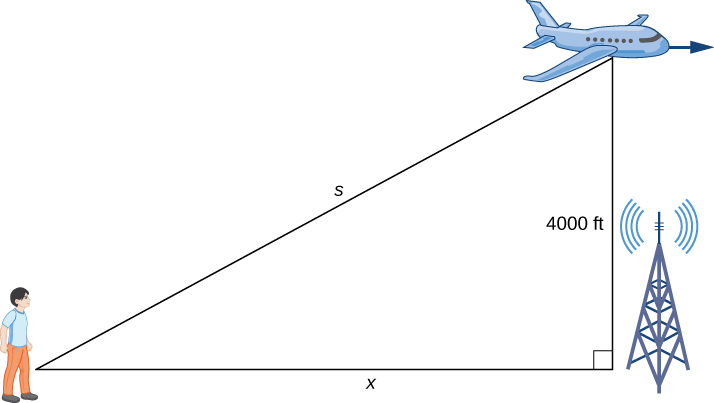

$$
    % Differentials d[something]/d[something]
    \gdef\diff#1#2{\frac{\mathrm{d}#1}{\mathrm{d}#2}}
    % Shortcut for dy/dx
    \gdef\dydx{\diff{y}{x}}
    \gdef\nimplies{\;\;\;\not\nobreak\!\!\!\!\implies\;}
$$

# 4.1 — Related Rates

When a quantity changes over time, its **rate of change** is given by its derivative.

If two related quantities are changing over time, then their rates of change (i.e., derivatives) are related as well.

For example, if a balloon is being filled with air, both the **radius** and the **volume** of the balloon are increasing, and are related. In other words, the rate at which the radius are changing is also related with the rate at which the volume is changing.

In this case, both radius ($r$) and volume ($V$) are changing with respect to time ($t$). As such, we denote the respective rates with the following:

* $\diff{V}{t}$ --- the rate of change of volume ($V$) with respect to time ($t$).
* $\diff{r}{t}$ --- the rate of change of radius ($r$) with respect to time ($t$).

<note>

One can also express the variable $V$ as a function of time. That is, $V(t)$.

Similarly, the radius can also be expressed as $r(t)$.

</note>

Since both of the rates are changing with respect to time, we say that $\diff{V}{t}$ and $\diff{r}{t}$ are related.

<eg>

A spherical balloon is being filled with air at a rate of $2\text{ cm}^3\text{/s}$. How fast is the radius of the balloon is increasing when the radius is $3 \text{ cm}$?

Recall that the volume of a sphere is given by:
$$
V = \frac{4}{3}\pi r^3
$$

Since the balloon is being filled with air, volume ($V$) and radius ($r$) can be expressed as functions of time ($t$).

$$
V(t) = \frac{4}{3}\pi (r(t))^3
$$

We want the **rate of change** of radius when $r = 3$. Therefore, we want the function $r'(t)$.

In order to obtain $r'(t)$, we first take the derivative of our volume equation.

$$
\begin{aligned}
    V'(t) &= \frac{4}{\cancel{3}} \cdot \cancel{3}\pi \cdot (r(t))^2 \cdot r'(t) \\
    &= 4\pi \cdot (r(t))^2 \cdot r'(t)
\end{aligned}
$$

<note>

Note that the expression
$$
V'(t) = 4\pi \cdot (r(t))^2 \cdot r'(t)
$$

can also be expressed with the notation:
$$
\diff{V}{t} = 4\pi r^2 \cdot \diff{r}{t}.
$$

</note>

Since we are adding $2\text{ cm}^3\text{/s}$ of air into the balloon, that implies that the **volume is increasing** at a rate of $2\text{ cm}^3\text{/s}$. As such, we have that:

$$
V'(t) = 2.
$$

Therefore,
$$
\begin{aligned}
   4\pi \cdot (r(t))^2 \cdot r'(t) &= 2 \\
   r'(t) &= \frac{2}{4\pi \cdot (r(t))^2 } \\
   &= \frac{1}{2\pi \cdot (r(t))^2}
\end{aligned}
$$

To get the rate of change when $r(t) = 3$, we simply substitute the value in:

$$
\begin{aligned}
    r'(t) &= \frac{1}{2\pi \cdot (r(t))^2} \\
    &= \frac{1}{2\pi \cdot 3^2} \\
    &= \frac{1}{18\pi}\text{ cm/s}.
\end{aligned}
$$

</eg>

## Process for solving related rates problems

1. Try to write an equation that relates all of the variables we are dealing with.
2. Then, differentiate both sides of our equation. This new equation will relate the derivatives.
3. Substitute in the values and solve.

<eg>

Let $A$ be the area of the circle. If $\diff{r}{t} = 4$, where $r$ is the radius and $t$ is time. Find $\diff{A}{t}$ when $r=1$.

Recall that the area of a circle is given by:
$$
A = \pi r^2.
$$

Then, differentiate it with respect to time $t$:
$$
\begin{aligned}
    \diff{A}{t} &= \pi \cdot 2r \cdot \diff{r}{t} \\
    &= 2\pi r \cdot \diff{r}{t}
\end{aligned}
$$

Finally, we can substitute the values for $\diff{r}{t}$ and $r$ to find $\diff{A}{t}$:
$$
\begin{aligned}
    \diff{A}{t} &= 2\pi \cdot 1 \cdot 4 \\
    &= 8\pi r
\end{aligned}
$$

</eg>

<eg>

A plane is flying overhead at a constant elevation of $4000\text{ ft}$. A man is watching the plane from the ground.

The plane is flying horizontally away from the man at a rate of $600\text{ ft/s}$. At what rate is the distance from the man to the plane increasing when the plane is exactly $3000\text{ ft}$ horizontally away from the man?

Let $s$ represent the distance from the man to plane ($\text{ft}$).
Let $x$ represent the horizontal distance from the man to plane ($\text{ft}$).

Using the pythagorean theorem, let $s$ be the hypotenuse side of the triangle. Then, we have that:
$$
x^2 + 4000^2 = s^2.
$$

Differentiating the equation above yields:
$$
2x\diff{x}{t} = 2s\diff{s}{t}.
$$

Since $x = 3000\text{ ft}$ and $\diff{x}{t} = 600\text{ ft/s}$, we have that:
$$
    2(3000)(600) = 2s\diff{s}{t}.
$$

Recall that the distances are bound by the pythagorean theorem, we can substitute the value for $x$ in order to find $s$:
$$
3000^2 + 4000^2 = s^2 \\
\begin{aligned}
    \therefore s &= \sqrt{3000^2 + 4000^2} \\
    &= 5000.
\end{aligned}
$$

Finally, we can substitute $s$ in our expression to solve for $\diff{s}{t}$:
$$
\begin{aligned}
    \cancel{2}(3000)(600) &= \cancel{2}(5000)\diff{s}{t} \\
    \diff{s}{t} &= \frac{(3\cancel{000})(600)}{5\cancel{000}} \\
    &= \frac{1800}{5} \\
    &= 360.
\end{aligned}
$$

The distance from the man to the plane is increasing at a rate of $360\text{ ft/sec}$ when the plane is exactly $3000\text{ ft}$ horizontally away from the man.

</eg>

<eg>

A rocket is launched so that it rises vertically (i.e., going straight up in the air). There is a camera that is positioned $5000\text{ ft}$ from the launchpad. When the rocket is $1000\text{ ft}$ above the ground, its velocity is $600\text{ ft/sec}$.

Find the rate of change of the camera's angle such that it stays focus on the rocket.

Let $h$ be the vertical height of the rocket.
And let $\theta$ be the angle from the ground to the rocket at which the camera is pointed at.

From the right triangle above, we can derive an expression for $h$ using the common trig identity:
$$
\tan\theta = \frac{h}{5000} \\
\therefore h = 5000 \tan\theta
$$

Then, we can differentiate the expression above to get:
$$
\begin{aligned}
    \diff{h}{t} = 5000 \sec^2(\theta) \diff{\theta}{t}.
\end{aligned}
$$

Recall that when $h = 1000$, $\diff{h}{t} = 600\text{ ft/s}$.
$$
600 = 5000 \sec^2(\theta) \diff{\theta}{t} \\
\frac{3}{25} = \sec^2(\theta) \diff{\theta}{t}
$$

Lastly, in order to solve for $\diff{\theta}{t}$, we need to find what $\sec^2\theta$ is.

<note>

Recall the trigonometric identity for $\sec\theta$:
$$
\sec\theta = \frac{1}{\cos\theta} = \frac{1}{\frac{\text{adjacent}}{\text{hypotenuse}}} = \frac{\text{hypotenuse}}{\text{adjacent}}
$$

</note>

Using the trig identity, we have that:
$$
\sec\theta = \frac{c}{5000}
$$

where $c$ is the hypotenuse.

Using the pythagorean theorem, we have that:
$$
c^2 = 5000^2 + 1000^2 \\
\begin{aligned}
    c &= \sqrt{5000^2 + 1000^2} \\
    &= 1000\sqrt{26}
\end{aligned}
$$

As such:
$$
\begin{aligned}
    \sec^2\theta &= \left(\frac{\cancel{1000}\sqrt{26}}{5\cancel{000}}\right)^2 \\
    &= \left(\frac{\sqrt{26}}{5}\right)^2 \\
    &= \frac{26}{25}
\end{aligned}
$$

Finally, we have that:
$$
\frac{3}{25} = \frac{26}{25} \diff{\theta}{t} \\
\begin{aligned}
    \therefore \diff{\theta}{t} &= \frac{3}{\cancel{25}} \cdot \frac{\cancel{25}}{26} \\
    &= \frac{3}{26} \\
\end{aligned}
$$

The angle of the camera must change at a rate of $\frac{3}{26}\text{ rad/s}$ in order to maintain focus on the rocket.

</eg>

<eg>

A rotating light is $10\text{ ft}$ away from a wall. The light completes a rotation every $5$ seconds. Find the rate at which the light projected onto the wall is moving along the wall when the light's angle is $10\degree$ from perpendicular to the wall.

Where $10$ is the length adjacent to the angle away from the wall, and $x$ is the side opposite of $\theta$, we have:
$$
\tan\theta = \frac{x}{10} \\
\therefore 10 \tan\theta = x.
$$

Differentiating the expression above produces:
$$
10\sec^2(\theta)\diff{\theta}{t} = \diff{x}{t}.
$$

<note>

$$
360\degree = 2\pi \\
\therefore \theta =  10\degree = \frac{360\degree}{36} = \frac{2\pi}{36} = \frac{\pi}{18}
$$

</note>

Substitute $\theta$ in radians:
$$
10\sec^2\left(\frac{\pi}{18}\right)\diff{\theta}{t} = \diff{x}{t}.
$$

Finally, to solve for $\diff{x}{t}$, we need to find $\diff{\theta}{t}$.

Recall that the light completes a rotation every $5$ seconds. This means that, assuming the rotational speed is constant:
$$
\diff{\theta}{t} = \frac{2\pi}{5}.
$$

Substituting our final piece of the puzzle, we have:
$$
10\sec^2\left(\frac{\pi}{18}\right)\frac{2\pi}{5} = \diff{x}{t}
$$

Then, simplify:
$$
\frac{20\pi}{5} \sec^2\left(\frac{\pi}{18}\right) = \diff{x}{t} \\
\begin{aligned}
\therefore \diff{x}{t} &= 4\pi \sec^2\left(\frac{\pi}{18}\right) \\
&\approx 12.95707
\end{aligned}
$$

The light projected onto the wall is moving along the wall at the rate of approximately $12.95707\text{ ft/s}$ when the light's angle is $10\degree$ from perpendicular to the wall.

</eg>

