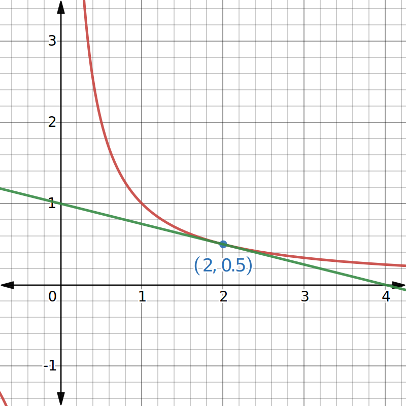
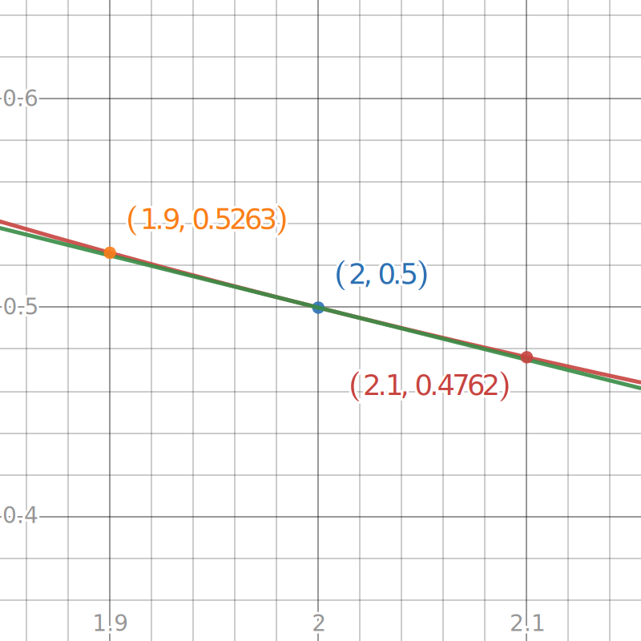
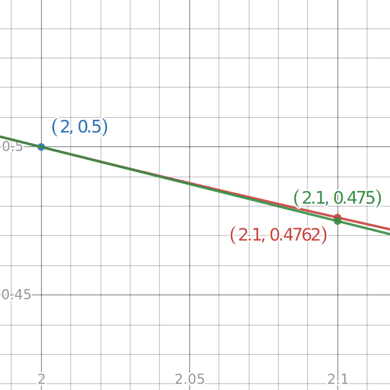

$$
    % Differentials d[something]/d[something]
    \gdef\diff#1#2{\frac{\mathrm{d}#1}{\mathrm{d}#2}}
    % Shortcut for dy/dx
    \gdef\dydx{\diff{y}{x}}
    % Shortcut for not implies
    \gdef\nimplies{\;\;\;\not\nobreak\!\!\!\!\implies\;}
    % Shortcuts for extended brackets
    \gdef\({\left(} \gdef\){\right)}
    % Shortcut for real number symbol
    \gdef\R{\mathbb{R}}
$$

# 4.2 — Linear Approximations

# Refresher: tangent lines

Consider a function $f(x)$.

Recall that the tangent line to $f(x)$ at $x = a$ is a line that intersects the function at the point $(a, f(a))$.

And the slope of the tangent line is equal to the derivative of $f(x)$ at $x = a$. That is, $f'(a)$.

Previously, we have written equations for tangent lines of functions at specific points.

<def>

## Equation of a tangent line

The equation of the tangent to $f(x)$ at the point $x = a$ is given by:
$$
y = f(a) + f'(a)(x-a).
$$

</def>

<eg>

Let $f(x) = \frac{1}{x}$. Find the equation of the tangent line at $x = 2$.

To find the tangent line, we need a point on the tangent line and the slope of the function at that point, i.e., $(2, f(2))$ and $f'(2)$.

$$
f(2) = \frac{1}{2} \\
\therefore (2, f(2)) = \(2, \frac{1}{2}\)
$$

Then, we need to find the slope at that point.

$$
f'(x) = -x^{-2} = -\frac{1}{x^2} \\
\therefore f'(2) = -\frac{1}{4}
$$

As such, we have that the equation of the tangent at $x = 2$ is:
$$
\begin{aligned}
    y &= \frac{1}{2} - \frac{1}{4}(x - 2) \\
    &= \frac{1}{2} - \frac{1}{4}x + \frac{2}{4} \\
    &= 1 - \frac{1}{4}x.
\end{aligned}
$$

<note>

In order to use the equation of the tangent to approximate certain values of $x$, it may be more helpful to leave the equation in the **point-slope** form, as we'll see later.

In this case, the equation of the tangent at $x = 2$ in the point-slope form is:
$$
y - \frac{1}{2} = - \frac{x - 2}{4}.
$$

</note>

</eg>

# Linear approximation

While the function $f(x)$ and its tangent only intersects at a single point, the neighborhood around that point the function and tangent line are "close." Due to this fact, we can use a tangent line to approximate a function's value at a specific point.

Let's continue to use the function $f(x) = \frac{1}{x}$ as our example.
Below, $f(x)$ is graphed in red, where its tangent line at $x = 2$ is in green.

|                                                                                  |                                                                                                                                           |
| -------------------------------------------------------------------------------- | ----------------------------------------------------------------------------------------------------------------------------------------- |
|  | We can see on the left that its tangent line at $x = 2$ (green) only touches the graph of $f$ (red) once at that point.                   |
|  | When we zoom in closer around $(2, \frac{1}{2})$, we can see that the neighboring values around $2$ is very close to the value of $f(2)$. |

With this knowledge, let's use our tangent to approximate what $f(2.1)$ is.

<eg>

Let $f$ be a function such that $f(x) = \frac{1}{x}$. Use the equation of the tangent at $x = 2$ to approximate the value of $f(2.1)$.

Recall that the equation of the tangent line to $f$ at $x = 2$ is:
$$
y - \frac{1}{2} = - \frac{x - 2}{4}.
$$

To approximate the value of $f(2.1)$, we can use the equation of the tangent by substituting $x$.
$$
y - \frac{1}{2} = - \frac{2.1 - 2}{4} \\
y - \frac{1}{2} = - \frac{0.1}{4} \\
y = -0.025 + 0.5 \\
y = 0.475
$$

Using this method, we found that:
$$
f(2.1) \approx 0.475.
$$

Now let's evaluate $f(2.1)$ to see how close our approximation was.
$$
f(2.1) = \frac{1}{2.1} \approx 0.47619
$$

|                                                          |
| ---------------------------------------------------------------------------------------------------------------------------------------- |
| As you can see, the value that we got using the equation of the tangent line at $x = 2$ can serve as a close approximation for $f(2.1)$. |

</eg>

This process is known as **linear approximation**.

When performing linear approximation, we make a linear approximation function and use it to make predictions for $f(x)$.

<def>

## Linear approximation function

From our earlier example, we concluded that the equation of the tangent line to a differentiable function $f$ at $x = a$ can be used to approximate $f(x)$ **for $x$ near $a$**.

$$
f(x) \approx f(a) + f'(a)(x - a) \quad \text{where }x\text{ is near }a.
$$

As such, we can derive the linear approximation function, $L$, to be the following:
$$
L(x) = f(a) + f'(a)(x - a)
$$

</def>

<eg>

Find the linear approximation of $f(x) = \sqrt{x}$ at $x = 9$ and use it to approximate $\sqrt{9.1}$.

Here, $x = 9$ is a value in the domain of $f$ that works out nicely and is close to $9.1$.

$$
f(x) = \sqrt{x} \implies f'(x) = \frac{1}{2\sqrt{x}} \\
f(9) = \sqrt{9} = 3 \\
f'(9) = \frac{1}{2\sqrt{9}} = \frac{1}{6}
$$

Using the linear approximation equation, we have that:
$$
\begin{aligned}
    L(x) &= f(9) + f'(9)(x - 9) \\
    &= 3 + \frac{1}{6}(x - 9) \\
\end{aligned}
$$

Now, we can use $L(x)$ to approximate the value of $\sqrt{9.1}$.

<important>

Note that we are using $L(x)$ to **approximate** the value of $f(9.1)$.

This means that $L(9.1) \approx f(9.1)$ and $L(9.1) \neq f(9.1)$.

</important>

$$
\begin{aligned}
    f(9.1) = \sqrt{9.1} &\approx L(9.1) \\
    &= 3 + \frac{1}{6}(9.1 - 9) \\
    &= 3 + \frac{1}{6}(0.1)\\
    &\approx 3.0167
\end{aligned}
$$

As such, we have that the value of $\sqrt{9.1}$ is approximately $3.0167$.

</eg>

## So, what's the fucking point of this?

Linear approximations are and/or were used to estimates computations that are too difficult to calculate by hand, like $\sqrt{9.1}$.

We can also use linear approximation for estimates of trigonometric lengths by using the known values to come up with the approximation function.

<eg>

Find the linear approximation of $f(x) = \sin x$ at $x = \frac{\pi}{3}$, and use it to approximate $\sin \(\frac{62\pi}{180}\)$.

<note>

$\frac{62\pi}{180}$ is close to $\frac{\pi}{3}$, as such we can use linear approximation to find an estimate value of $\sin \(\frac{62\pi}{180}\)$.

$$
\frac{62\pi}{180} = 62\degree \\[.5em]
\frac{\pi}{3} = 60\degree \\[.5em]
60\degree \approx 62\degree
$$

</note>

$$
f(x) = \sin x \implies f'(x) = \cos x \\
f\(\frac{\pi}{3}\) = \sin\frac{\pi}{3} = \frac{\sqrt{3}}{2} \\
f'\(\frac{\pi}{3}\) = \cos\frac{\pi}{3} = \frac{1}{2}
$$

Using the linear approximation function, we have that:
$$
\begin{aligned}
    L(x) &= f\(\frac{\pi}{3}\) + f'\(\frac{\pi}{3}\)\(x - \frac{\pi}{3}\) \\
    &= \frac{\sqrt{3}}{2} + \frac{1}{2}\(x-\frac{\pi}{3}\)
\end{aligned}
$$

Now, we can use $L(x)$ to estimate the value of $\sin\frac{62\pi}{180}$.
$$
\begin{aligned}
    f\(\frac{62\pi}{180}\) = \sin\frac{62\pi}{180} &\approx L\(\frac{62\pi}{180}\) \\
    &= \frac{\sqrt{3}}{2} + \frac{1}{2}\(\frac{62\pi}{180} - \frac{\pi}{3}\) \\
    &= \frac{\sqrt{3}}{2} + \frac{1}{2}\(\frac{31\pi}{90} - \frac{\pi}{3}\) \\
    &= \frac{\sqrt{3}}{2} + \frac{1}{2}\(\frac{31\pi - 30\pi}{90}\) \\
    &= \frac{\sqrt{3}}{2} + \frac{1}{2}\(\frac{\pi}{90}\) \\
    &= \frac{1}{2}\(\sqrt{3} + \frac{\pi}{90}\) \\
    &\approx 0.8835
\end{aligned}
$$

As such, we have that $\sin \(\frac{62\pi}{180}\) \approx 0.8835$.

</eg>

<eg>

Find the linear approximation of $f(x) = (1 + x)^3$ at $x = 0$, and use it to estimate $(1.01)^3$.

<important>

Here, we want an estimation for $1.01^3$.

Since $f(x) = (1 + x)^3$, we need $x = 0.1$ in order for $f(x) = 1.01^3$.
$$
(1 + x)^3 = 1.01^3 \implies x = 0.1
$$

The nearest "nice" value to $1.01$ for which we can calculate its cube is $1$. Therefore, we need to linearize $f$ for some number $x$ such that $f(x) = 1$.
$$
(1 + x)^3 = 1^3 = 1 \implies x = 0
$$

</important>

$$
f(x) = (1 + x)^3 \implies f'(x) = 3(1 + x)^2 \\
f(0) = (1 + 0)^3 = 1 \\
f'(0) = 3(1 + 0)^2 = 3 \\
$$

$$
\begin{aligned}
    L(x) &= f(0) + f'(0)(x - 0) \\
    &= 1 + 3(x - 0) \\
    &= 1 + 3x
\end{aligned}
$$

Using $L(x)$ to approximate $1.01^3$:
$$
\begin{aligned}
   f(0.01) = 1.01^3 &\approx L(0.01) \\
   &= 1 + 3(0.01) \\
   &= 1 + 0.03 \\
   &= 1.03
\end{aligned}
$$

As such, we have that $1.01^3 \approx 1.03$.

<note>

We can actually calculate the exact value of $1.01^3$, which we can use to compare with our linear approximation.
$$
1.01^3 = 1.01 \cdot 1.01 \cdot 1.01 = 1.030301
$$

As you can see, our approximation was accurate up to two decimal places.
$$
1.03 \approx 1.030301
$$

</note>

</eg>

