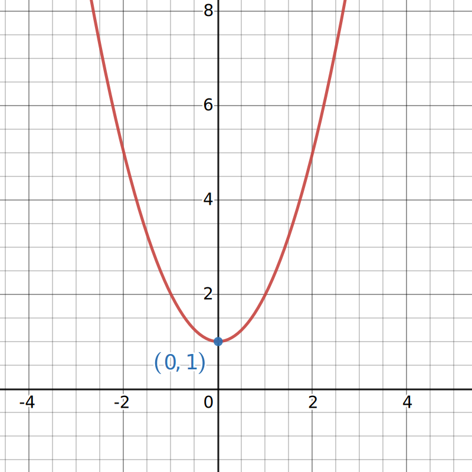
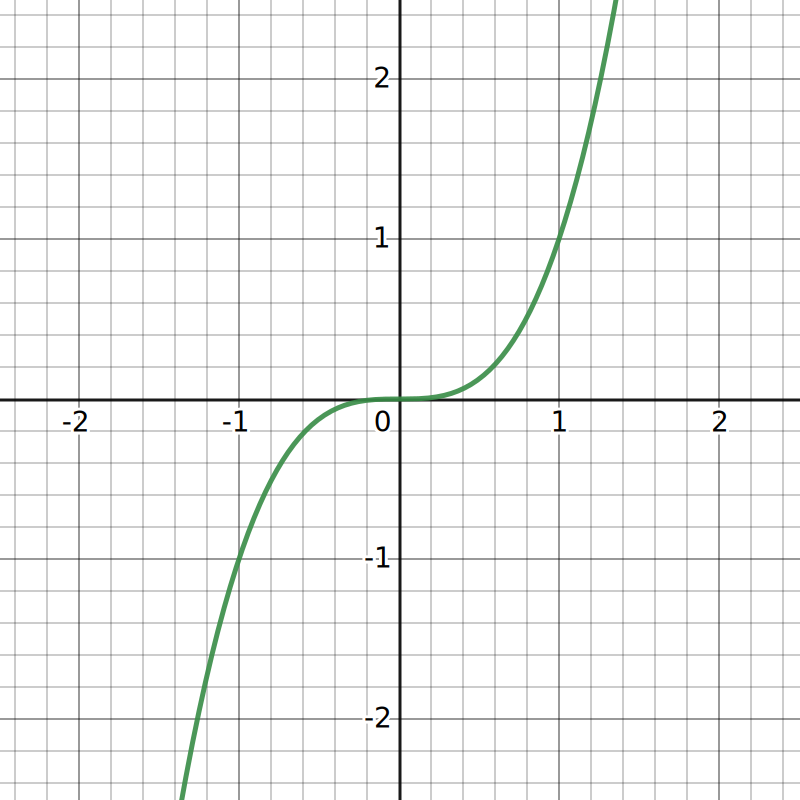
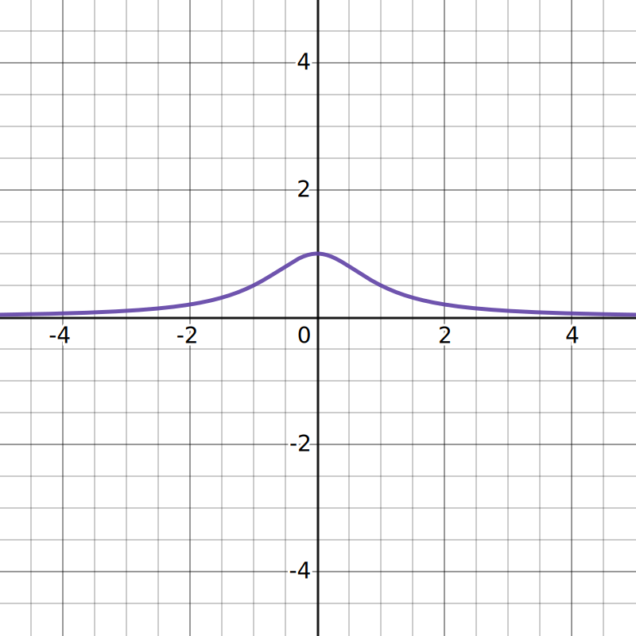
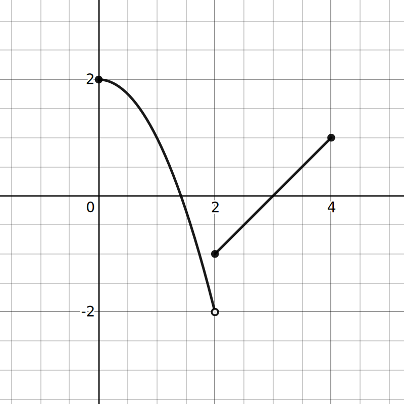
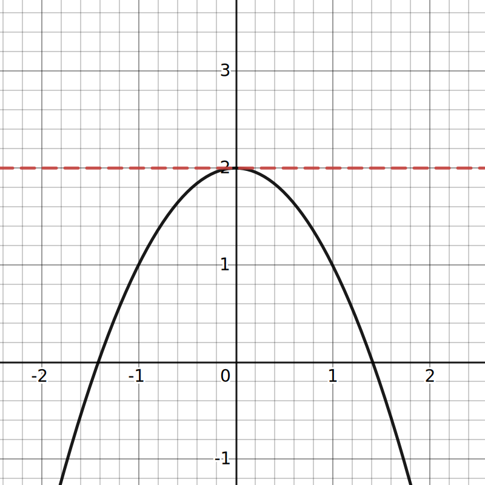
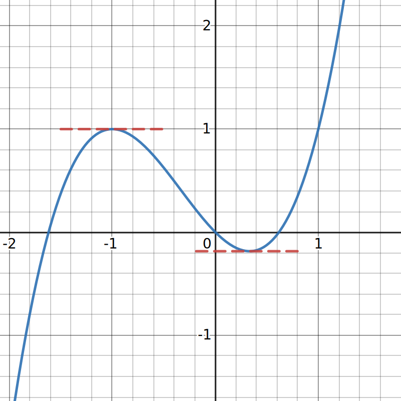
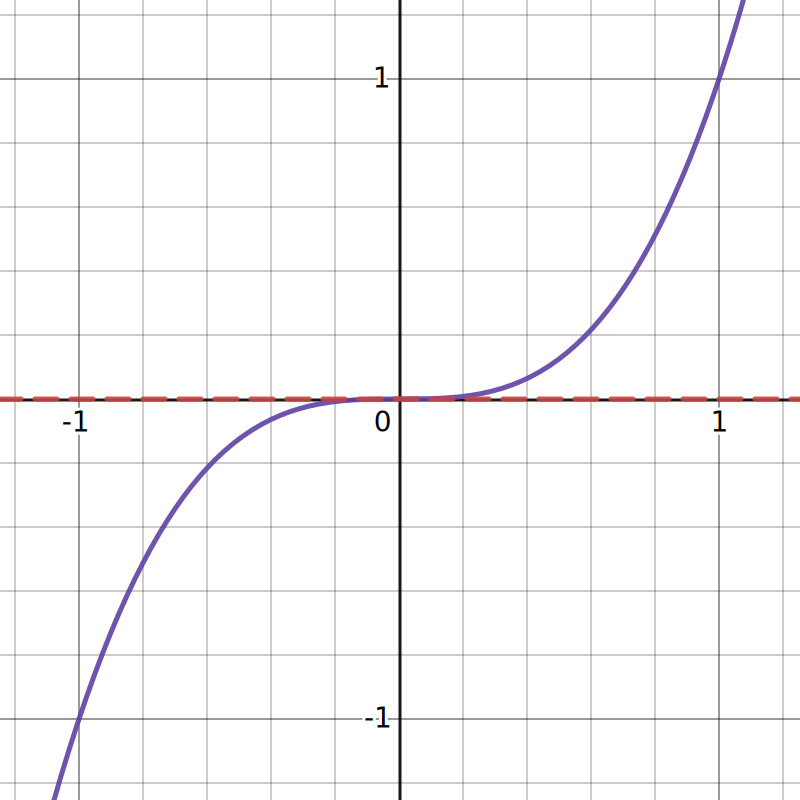
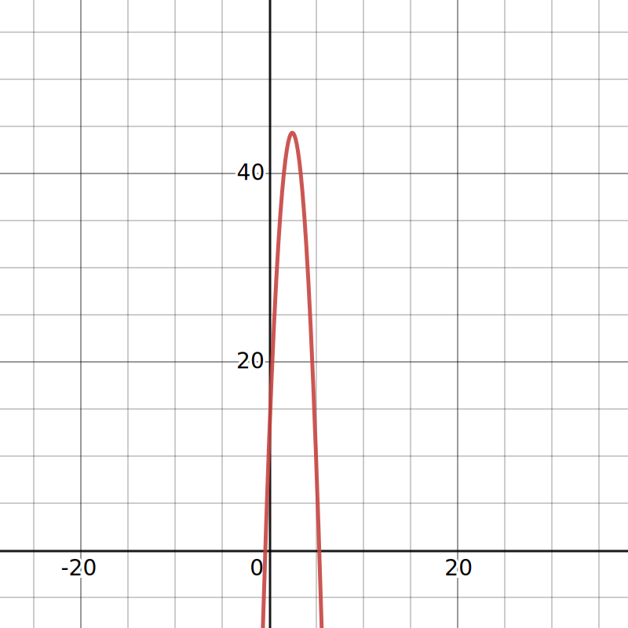

$$
    % Differentials d[something]/d[something]
    \gdef\diff#1#2{\frac{\mathrm{d}#1}{\mathrm{d}#2}}
    % Shortcut for dy/dx
    \gdef\dydx{\diff{y}{x}}
    % Shortcut for not implies
    \gdef\nimplies{\;\;\;\not\nobreak\!\!\!\!\implies\;}
    % Shortcuts for extended brackets
    \gdef\({\left(} \gdef\){\right)}
    % Shortcut for real number symbol
    \gdef\R{\mathbb{R}}
$$

# 4.3 — Maxima and Minima

The maximum and minimum of a function represent the largest and smallest values the function will ever equal. Today, we'll examine several types of maxima and minima.

# Absolute extrema

<def>

Let $f$ be a function defined over an interval $I$, and let $c$ be a number such that $c \in I$.

## Absolute maximum

We say that $f$ has an absolute maximum on $I$ at $c$ if $f(c) \geq f(x)$ for all $x \in I$.

## Absolute minimum

We say that $f$ has an absolute minimum on $I$ at $c$ if $f(c) \leq f(x)$ for all $x \in I$.

## Absolute extremum

We say that $f$ has an absolute extremum on $I$ at $c$ if $f$ has an absolute maximum on $I$ at $c$ or an absolute minimum on $I$ at $c$.

</def>

A function may have both an absolute maximum and an absolute minimum, just one extremum, or neither.

<eg>

|  |
| -------------------------------------------------------------------------------- |
| Let $f(x) = x^2 + 1$. Find the absolute minimum and absolute maximum of $f$.     |

As you can see, the lowest point of $f$ is at $x = 0$.
As such, we say that the absolute minima of $f$ is $1$ at $x = 0$.

As for the absolute maximum, the value of $f$ will increase as the absolute value of $x$ increases (i.e., the range of $f$ is $(\infty,\infty)$). Therefore, we say that $f$ does not have an absolute maximum.

</eg>

<eg>

|  |
| -------------------------------------------------------------------------------- |
| Let $g(x) = x^3$. Find the absolute minimum and absolute maximum of $g$.         |

Here, the value of $g$ increases as the value of $x$ increases. Conversely, the value of $g$ decreases as the value of $x$ decreases.

As such, we say that $g$ does not have an absolute maximum or absolute maximum.

</eg>

<eg>

|        |
| -------------------------------------------------------------------------------------- |
| Let $h(x) = \frac{1}{x^2 + 1}$. Find the absolute minimum and absolute maximum of $h$. |

Here, we can see that $h$ "peaks" at $x = 0$, then decreases on either sides.
As such, we say that the absolute maxima of $h$ is $1$ at $x = 0$.

Note that as the graph of $h$ approaches the x-axis on either sides, it is asymptotic to the x-axis. This means that it never reaches zero as the absolute value of $x$ increases.
As such, we say that $h$ does not have an absolute minimum.

</eg>

<eg>

|                                                              |
| -------------------------------------------------------------------------------------------------------------------------------------------- |
| Let $k(x) = \begin{cases} 2-x^2 & 0 \leq x \lt 2 \\ x-3 & 2\leq x \leq 4\end{cases}$. Find the absolute minimum and absolute maximum of $k$. |

Here, we see that the domain of $k$ is $[0,4]$, where the highest value is $2$ at $x = 0$.
As such, we say that the absolute maxima of $k$ is $2$ at $x = 0$.

On the graph, we see that the lowest point of the graph is around $-2$. However, since $k$ is not defined at $-2$, we have the value of $k$ will never reach $-2$.
As such, we say that $k$ does not have an absolute minima.

</eg>

Three of the examples above had just one extremum. This is due to the fact that those three functions, $f$, $g$, and $h$, were **unbounded**, meaning that their domains were $(-\infty, \infty)$. However, the following theorem, called the Extreme Value Theorem, guarantees that a continuous function $f$ over a closed, bounded interval $[a, b]$ has **both** an absolute maximum and an absolute minimum.

<theo>

## Extreme value theorem

If $f$ is a continuous function over the close, bounded interval $[a,b]$, then there exists a point in $[a,b]$ at which $f$ has an absolute minimum and absolute minimum.

</theo>

# Local extrema and critical points

<def>

Let $f$ be a function where $I$ is an open interval in the domain of $f$, and let $c$ be a number such that $c \in I$.

## Local maximum

We say that $f$ has a local maximum at $x = c$ if $f(c) \geq f(x)$ for all $x \in I$.

## Local minimum

We say that $f$ has a local minimum at $x = c$ if $f(c) \leq f(x)$ for all $x \in I$.

## Local extremum

We say that $f$ has a local extremum at $c$ if $f$ has a local maximum at $c$ or local minimum at $c$.

</def>

<def>

## Critical point

If $c$ is an interior point in the domain of $f$, then it is said that $c$ is a critical point of $f$ if $f'(c) = 0$ or $f'(c)$ is undefined.

<note>

An interior point is a point on the graph of $f$ such that it is not an endpoint of $f$.

</note>

</def>

<eg>

Find the critical points of the function $f$ such that:
$$
f(x) = \frac{1}{3}x^3 - \frac{5}{2}x^2 + 4x.
$$

To find the critical points, we first find $f'(x)$.
$$
\begin{aligned}
    f'(x) &= \frac{3}{3}x^2 - \frac{10}{2}x + 4 \\
    &= x^2 - 5x + 4
\end{aligned}
$$

Then, let $f'(x) = 0$ and solve for $x$.
$$
x^2 - 5x + 4 = 0 \\
(x - 4)(x - 1) = 0 \\
\therefore x = 1, 4
$$

So, we have that the two critical points of $f$ are at $x = 1$ and $x = 4$.

</eg>

Recall that for a function $f$, when $f'(x) = 0$, there exists a horizontal tangent line at those points.

| $f(x) = -x^2 + 2$                                                                | $g(x) = x^3 + x^2 - x$                                                           | $h(x) = x^3$                                                                     |
| -------------------------------------------------------------------------------- | -------------------------------------------------------------------------------- | -------------------------------------------------------------------------------- |
|  |  |  |

<theo>

## Fermat's theorem

If $f$ has a local extremum at $c$ and $f$ is differentiable at $c$, then $f'(c) = 0$.

<important>

Note that this **does not** mean that every critical point is a local maxima or minima.
$$
\text{critical point}\nimplies\text{a local maxima/minima}
$$

However, it **does** implies that every local maximums and minimums is a critical point.
$$
\text{a local maxima/minima}\implies\text{critical point}
$$

</important>

</theo>

<theo>

## Locating absolute extrema

Let $f$ be continuous function over a close, bounded interval $I$. Then, the absolute maximum and absolute minimum of $f$ over $I$ must occur at either a critical point, or the endpoints of $I$.

</theo>

### How to: locate the absolute extrema over a closed interval

The above theorem gives us a nice way to locate the absolute extrema of a function $f$.

1. Evaluate $f$ at the end points of your interval.
2. Find all critical points and evaluate $f$ at those points.
3. Compare the values found in (1) and (2).
   Using the theorem above, we have that the absolute extrema must occur at endpoints or critical points. The largest of these values must be the absolute maximum of $f$, and the smallest must be the absolute minimum of $f$.

<eg>

Let $f(x) = -x^2 + 3x -2$. Find the absolute maximum and absolute minimum over the $[1,3]$ and state where those values occur.

1. Evaluate $f(x)$ at the endpoints.
$$
f(1) = -1^2 + 3(1) -2 = 0 \\
f(3) = -3^2 + 3(3) -2 = -2
$$
2. Find the critical points and evaluate $f$ at those points.
    2.1 Find the critical points by finding where $f'(x) = 0$.
    $$
    f(x) = -x^2 + 3x -2 \implies f'(x) = -2x + 3 \\
    -2x + 3 = 0 \implies x = \frac{3}{2}
    $$
    2.2 Then, evaluate $f$ at those points.
    $$
    f\(\frac{3}{2}\) = -\(\frac{3}{2}\)^2 + 3 \cdot \frac{3}{2} - 2 = \frac{1}{4}
    $$
3. Now, compare the values from (1) and (2) to find the absolute extrema.
$$
\begin{array}{c|cc}
    x & f(x)\\
    \hline
    1 & 0 \\
    3/2 & 1/4 & \text{absolute maximum} \\
    3 & -2 & \text{absolute minimum}
\end{array}
$$

From the table, we can conclude that the absolute maximum of $f$ in $[1,3]$ is $\frac{1}{4}$ at $x = \frac{3}{2}$, and the absolute minimum of $f$ in $[1,3]$ is $-2$ at $x = 3$.

</eg>

<eg>

Let $f(x) = x^2 - 3x^{2/3}$. Find the absolute maximum and absolute minimum over the $[0,2]$ and state where those values occur.

1. Evaluate $f(x)$ at the endpoints.
$$
f(0) = 0^2 - 3(0)^{2/3} = 0 \\
f(2) = 2^2 - 3(2)^{2/3} = 4 - 3\sqrt[3]{4}
$$
2. Find the critical points and evaluate $f$ at those points.
    2.1. Find the critical points by finding where $f'(x) = 0$.
    $$
    f(x) = x^2 - 3x^{2/3} \implies f'(x) = 2x - 2x^{-1/3} = 2x - \frac{2}{\sqrt[3]{x}} \\
    2x - \frac{2}{\sqrt[3]{x}} = 0 \implies x = \pm1
    $$
    2.2 Then, evaluate $f$ at those points.
    
<note>

    Since $-1 \notin [0,2]$, we only need to evaluate $f(1)$.

    </note>

    $$
    f(1) = 1^2 - 3\sqrt[3]{1^2} = -2
    $$
3. Now, compare the values from (1) and (2) to find the absolute extrema.
$$
\begin{array}{c|cc}
    x & f(x)\\
    \hline
    0 & 0 & \text{absolute maximum} \\
    1 & -2 & \text{absolute minimum} \\
    2 & 4 - 3\sqrt[3]{4} \approx -0.762
\end{array}
$$

From the table, we can conclude that the absolute maximum of $f$ in $[0,2]$ is $0$ at $x = 0$, and the absolute minimum of $f$ in $[0,2]$ is $-2$ at $x = 1$.

</eg>

<eg>

A ball is thrown in to the air and its position is given by $h(t) = -5.4t^2 + 26t + 13$, where $h$ is the height of the ball in meters at time $t$ in seconds.

Find the maximum height reached by the ball and the time at which that happened.

|                                                                                                              |                                                                                  |
| ------------------------------------------------------------------------------------------------------------ | -------------------------------------------------------------------------------- |
| Note that the graph of $h$ is in a shape of an upside-down parabola, since it is a polynomial of degree $2$. |  |

Also note that when an object is thrown into the air, it will reach its highest point when its velocity reaches zero.

Therefore, we first need to differentiate $h$.
$$
h(t) = -5.4t^2 + 26t + 13 \implies h'(t) = -10.8t + 26
$$

Then, solve for $t$ when $h'(t) = 0$.
$$
-10.8t + 26 = 0 \implies t = \frac{26}{10.8} \approx 2.407
$$

To find the maximum height, evaluate $h\(\frac{26}{10.8}\)$.
$$
h\(\frac{26}{10.8}\) = -5.4\(\frac{26}{10.8}\)^2 + 26\(\frac{26}{10.8}\) + 13 \approx 44.296
$$

As such, the ball reached its maximum height of approximately $44.296\text{ m}$ after approximately $2.407\text{ s}$.

</eg>

<eg>

The function $f(x) = 4 + 8x + 200x^{-1}$ has one local minimum and one local maximum. Find those local extremum.

According to Fermat's theorem, if $f$ has a local extremum at $c$ and $f$ is differentiable at $c$, then $f'(c) = 0$.

So, we first differentiate $f$.
$$
f(x) =  4 + 8x + 200x^{-1} \implies f'(x) = 8 - 200x^{-2} = 8 - \frac{200}{x^2}
$$

Then, find the values of $x$ where $f'(x) = 0$.
$$
8 - \frac{200}{x^2} = 0 \\
8x^2 - 200 = 0 \\
x^2 = \frac{200}{8} = 25 \\
\therefore x = \pm5
$$

To find out which critical point is the maximum and which is the minimum, use $f(x)$.
$$
f(-5) = 4 + 8(-5) + \frac{200}{-5} = -76 \\
f(5) = 4 + 8(5) + \frac{200}{5} = 84
$$

Since $f(-5) > f(5)$, we have that the local minimum of $f$ is $-76$ at $x = -5$, and the local maximum of $f$ is $84$ at $x = 5$.

</eg>

