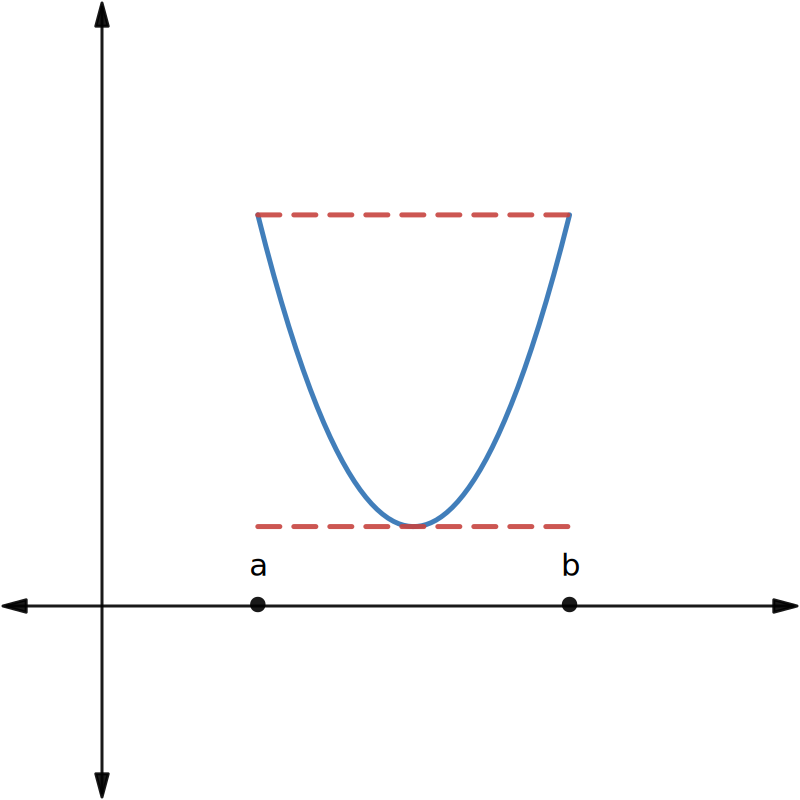
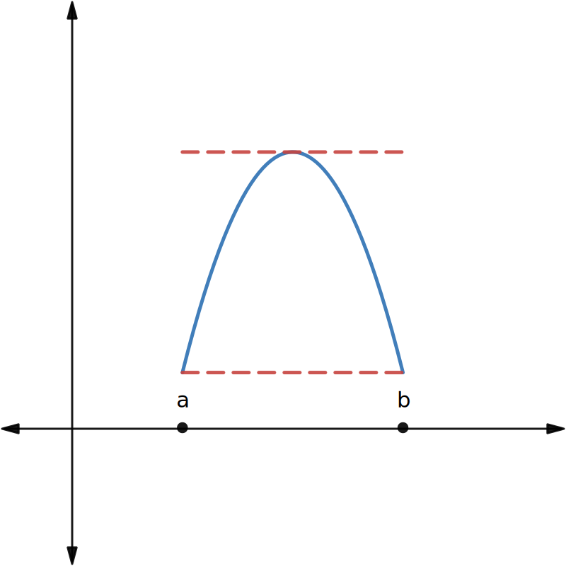
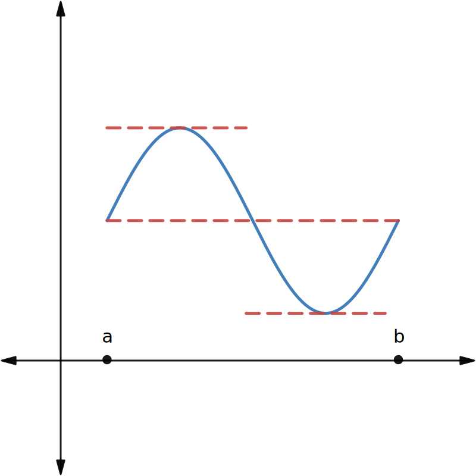
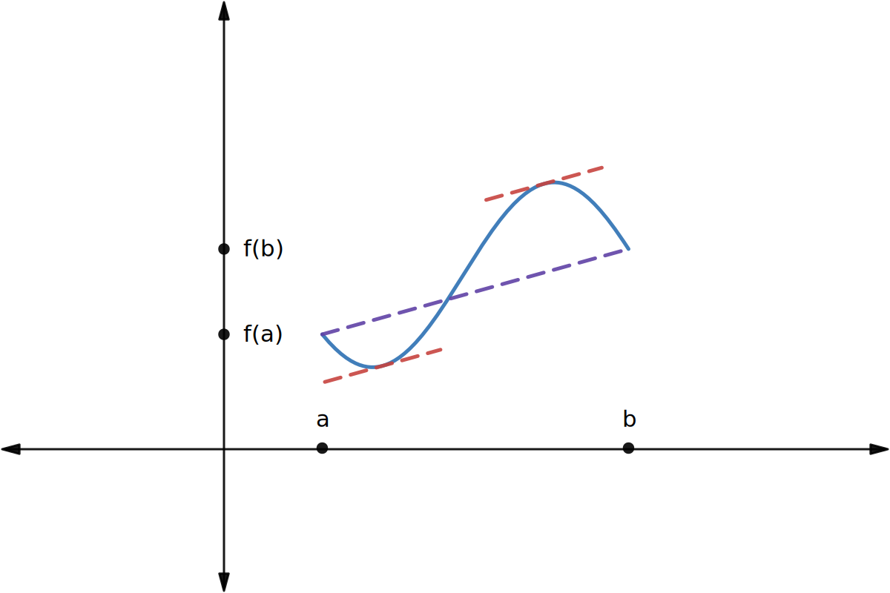

$$
    % Differentials d[something]/d[something]
    \gdef\diff#1#2{\frac{\mathrm{d}#1}{\mathrm{d}#2}}
    % Shortcut for dy/dx
    \gdef\dydx{\diff{y}{x}}
    % Shortcut for not implies
    \gdef\nimplies{\;\;\;\not\nobreak\!\!\!\!\implies\;}
    % Shortcuts for extended brackets
    \gdef\({\left(} \gdef\){\right)}
    % Shortcut for real number symbol
    \gdef\R{\mathbb{R}}
$$

# 4.4 — The Mean Value Theorem

The Mean Value Theorem is one of the most important theorems in calculus. Before we do that, let's start with a special case of the Mean Value Theorem, called **Rolle's theorem**.

<theo>

## Rolle's theorem

Let $f$ be a continuous function over the closed interval $[a,b]$ and differentiable over the open interval $(a,b)$ such that $f(a) = f(b)$. There then exists at least one $c\in(a,b)$ such that $f'(c) = 0$.

The graphs below illustrates the theorem where each of the function are continuous and has the same value at $a$ and $b$. Note that the function may have than one value of $c$ such that its derivative at $c$ is zero.

|                                                                                  |                                                                                  |                                                                                  |
| -------------------------------------------------------------------------------- | -------------------------------------------------------------------------------- | -------------------------------------------------------------------------------- |
|  |  |  |

</theo>

<eg>

Consider the function $f(x) = x^3 - 4x$ over the interval $[-2. 2]$. Verify that Rolle's theorem applies in this case, then find any values $c$ such that $f'(c) = 0$ and $c \in [-2, 2]$.

First, note that $f$ is a polynomial function. Therefore, it must be the case that $f$ is continuous and differentiable for all values in its domain, including $[-2,2]$.

Furthermore, by evaluating $f$ at the endpoints, we have that:
$$
f(-2) = (-2)^3 - 4(-2) = 0 \\
f(2) = (2)^3 - 4(2) = 0.
$$

As such, we have that $f(-2) = f(2)$. Therefore, Rolle's theorem applies here.

Now, we differentiate $f$ and find the values $c$, such that $f'(c) = 0$.
$$
f(x) = x^3 - 4x \implies f'(x) = 3x^2 -4 \\
\begin{aligned}
    3x^2 - 4 &= 0 \\
    3x^2 &= 4 \\
    x^2 &= \frac{4}{3} \\
    x &= \pm\frac{2}{\sqrt{3}}
\end{aligned}
$$

As such, we have that $f'(c) = 0$ when $c = -\frac{2}{\sqrt{3}}$ and $c = \frac{2}{\sqrt{3}}$.

</eg>

The mean value theorem is a more general case of Rolle's theorem. One main distinction is that it does not require that a function to have the same values at their endpoints, e.g., $f(a) = f(b)$.

Below, we have a function $f$ over the interval $[a,b]$ where $f(a) \neq f(b)$.

The slope of the secant line (purple) connecting the two endpoints is given by:
$$
m_\text{secant} = \frac{f(b) - f(a)}{b - a}.
$$

The mean value theorem can be considered as a slanted version of Rolle's theorem, where if a function $f$ is continuous over an interval $[a,b]$, then there exists at least one point $c \in (a,b)$ such that the tangent line to the graph of $f$ is parallel to the secant line connecting the two endpoints.

The example above shows that there are two points on the graph of $f$ where the tangent lines (red) is parallel to the secant line connecting $(a, f(a))$ and $(b, f(b))$.

<theo>

## Mean value theorem

Let $f$ be continuous over the closed interval $[a,b]$ and differentiable over the open interval $(a,b)$. Then, there exists at least one point $c\in(a,b)$ such that
$$
f'(c) = \frac{f(b) - f(a)}{b - a}.
$$

In other words, this basically says that there exists a point $c$ such that the tangent line at $x = c$ is parallel to the secant line connecting $(a, f(a))$ and $(b, f(b))$.

</theo>

<eg>

Consider a function $f$ such that $f(x) = \sqrt{x}$ over the interval $[0,9]$.

By the mean value theorem, we have that a value $c \in [0,9]$ must exist such that $f'(c)$ is equal to the slope of the line connecting $(0, f(0))$ and $(9, f(9))$.

Find such values $c$.

First, find the slope of the secant from $(0, f(0))$ to $(9, f(9))$.
$$
m_{\text{secant}} = \frac{f(9) - f(0)}{9 - 0} = \frac{\sqrt{9} - \sqrt{0}}{9 - 0} = \frac{3}{9} = \frac{1}{3}
$$

Then, we differentiate $f$ to find the values of $c$ such that $f'(c) = \frac{1}{3}$.
$$
f(x) = \sqrt{x} \implies f'(x) = \frac{1}{2\sqrt{x}} \\
\begin{aligned}
    \frac{1}{2\sqrt{c}} &= \frac{1}{3} \\[1em]
    \sqrt{c} &= \frac{3}{2} \\[1em]
    c &= \frac{9}{4}
\end{aligned}
$$

As such, we have that $f'\(\frac{9}{4}\) = m_\text{secant} = \frac{1}{3}$.

</eg>

<eg>

A rock is dropped from a height of $100\text{ ft}$. Its position $t$ seconds after it is dropped until it hits the ground is given by the function $s(t) = -16t^2 + 100$.

1. Determine how long it takes before the rock hits the ground.
2. Find the average velocity $v_\text{avg}$ of the rock for when the rock is released and the rock hits the ground.
3. Find the time $t$ guaranteed by the mean value theorem when the instantaneous velocity of the rock is $v_\text{avg}$.

To determine how long it takes before the rock his the ground, we simply solve for $t$ when $s(t) = 0$.
$$
\begin{aligned}
    -16t^2 + 100 &= 0 \\
    t^2 &= \frac{100}{16} \\
    \therefore t &= \pm\frac{5}{2}
\end{aligned}
$$

Then, to find the average velocity, we need to find the difference in position over $t = 0$ and $t = \frac{5}{2}$.
$$
v_\text{avg} = \frac{f\(\frac{5}{2}\) - f(0)}{\frac{5}{2} - 0} = \frac{0 - 100}{\frac{5}{2}} = -40
$$

Finally, using the mean value theorem, we want a value $c$ such that $f'(c) = -40$.
$$
s(t) = -16t^2 + 100 \implies s'(t) = -32t \\
\begin{aligned}
   -32c & = -40 \\
   \therefore c &= \frac{40}{32} = \frac{5}{4}
\end{aligned}
$$

</eg>

