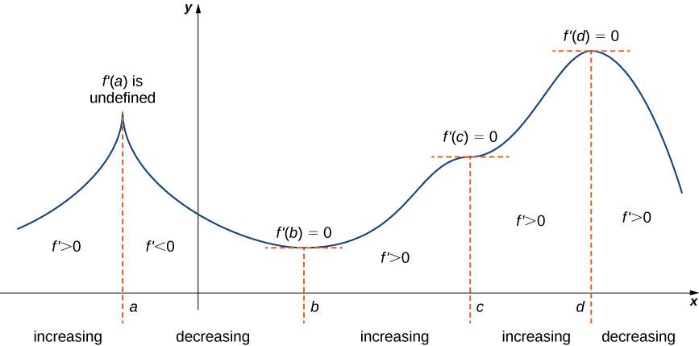

$$
    % Differentials d[something]/d[something]
    \gdef\diff#1#2{\frac{\mathrm{d}#1}{\mathrm{d}#2}}
    % Shortcut for dy/dx
    \gdef\dydx{\diff{y}{x}}
    % Shortcut for not implies
    \gdef\nimplies{\;\;\;\not\nobreak\!\!\!\!\implies\;}
    % Shortcuts for extended brackets
    \gdef\({\left(} \gdef\){\right)}
    % Shortcut for real number symbol
    \gdef\R{\mathbb{R}}
$$

# 4.5 — Derivatives and the Shape of a Graph

# First derivative test

Recall that the derivative is a rate of change.

If $f$ is a function, we know that $f$ is increasing when $f' > 0$ and $f$ is decreasing when $f' < 0$.

Using the shape of a graph, we can visually deduce whether a function is increasing or decreasing.

| Increasing function                                                              | Decreasing function                                                              |
| -------------------------------------------------------------------------------- | -------------------------------------------------------------------------------- |
|  |  |

Consider a continuous function $f$ with the graph below.

 

$f'(a)$ is undefined due to a sudden change in direction of $f$.

And $f(a) = f(b) = f(c) = 0$ because there exists a horizontal tangent to the graph of $f$ at those points.

This means that $a$, $b$, $c$, and $d$ are all critical points of the function $f$.

As we can see from the graph above, a function can only change from increasing to decreasing (or vice-versa) at a critical point.

<theo>

## First derivative test

Let $f$ be a continuous function over an interval $I$, and let $c$ be a critical point of $f$ on $I$. Then, the following holds:

1. $f(c)$ is a **local maximum** if $f'(x) > 0$ when $x < c$ and $f'(x) < 0$ when $x > c$.
2. $f(c)$ is a **local minimum** if $f'(x) < 0$ when $x < c$ and $f'(x) > 0$ when $x > c$.
3. $f(c)$ is **neither a local maximum nor a local minimum** if $f'(x)$ has the same sign for $x < c$ **and** $x > c$.

</theo>

Using the first derivative test, we can "divide" the interval into separate chunks using our critical points. Then, figure out where our function is increasing and decreasing.

<eg>

Consider the function $f(x) = x^3 - 3x^2 - 9x - 1$.
Locate any local extrema and determine on which intervals this function is increasing or decreasing.

First, we need to find the critical points.
$$
f(x) = x^3 - 3x^2 - 9x - 1 \implies f'(x) = 3x^2 - 6x - 9 \\
\begin{aligned}
    3x^2 - 6x - 9 &= 0 \\
    3(x^2 - 2x - 3) &= 0 \\
    3(x-3)(x-1) &= 0 \\
\therefore x = -1, 3
\end{aligned}
$$

Using the first derivative test, we can work out where $f$ is increasing and decreasing, and the nature of our critical points.

To do that, we evaluate $f'$ around the critical points to see how the sign changes around those points.

|  $x$  | $f'(x)$ |                            |
| :---: | :-----: | -------------------------- |
| $-2$  |  $15$   | increasing                 |
| $-1$  |   $0$   | critical point (local max) |
|  $0$  |  $-9$   | decreasing                 |
|  $3$  |   $0$   | critical point (local min) |
|  $4$  |  $63$   | increasing                 |

From the table, we can see that value of $f'$ goes from positive to negative around the critical point $x = -1$. This means that the local maximum of $f$ is at $x = -1$.

As for $x = 3$, we can see that the value of $f'$ goes from negative before $x = 3$ to positive after. This means that the local minimum of $f$ at $x = 3$.

</eg>

# Concavity

This is another layer to describe a function's increase or decrease. Concavity describes the curve of a function.

<def>

**Concave up**: the function curves upward. **Concave down**: the function curves downward.

| Concave up                                                                                 | Concave down                                                                               |
| ------------------------------------------------------------------------------------------ | ------------------------------------------------------------------------------------------ |
|  |  |

The concavity of the graph describes whether the rate of change is **increasing or decreasing**.

* An **increasing function** that is climbing *faster and faster* is **concave up**.
* A **decreasing function** that is climbing *slower and slower* is **concave down**.

</def>

<theo>

## Test for concavity

Let $f$ be a function that is differentiable function over an interval $(a, b)$.

* If $f''(x) > 0$ for all $x \in (a, b)$, then $f$ is **concave up**.
* If $f''(x) < 0$ for all $x \in (a, b)$, then $f$ is **concave down**.

<note>

$f''$ is the second derivative of the function $f$. Meaning, you differentiate $f$ twice.

</note>

</theo>

<def>

## Inflection point

If $f$ is a continuous function and its concavity changes at $a$, then $(a, f(a))$ is said to be an **inflection point** of $f$.

|                                                                     |
| --------------------------------------------------------------------------------------------------------------------------------------------------- |
| Here, we can see that $f$ is increasing to the left of $a$, then increases to the right of $a$. We call the point $(a, f(a))$ the inflection point. |

</def>

<eg>

Let $f(x) = x^3 - 6x^2 + 9x + 30$.
Determine all intervals where $f$ is concave up and all intervals where $f$ is concave down.

First, find all of the inflection points of $f$.
$$
f(x) = x^3 - 6x^2 + 9x + 30 \implies f'(x) = 3x^2 - 12x + 9 \implies f''(x) = 6x - 12
$$

Then, find the values of $x$ where $f''(x) = 0$.
$$
\begin{aligned}
    6x - 12 &= 0 \\
    6x &= 12 \\
    \therefore x &= 2
\end{aligned}
$$

Again, we set up a table and evaluate $f''$ around the inflection point.

|  $x$  | $f''(x)$ |                  |
| :---: | :------: | ---------------- |
|  $1$  |   $-6$   | concave down     |
|  $2$  |   $0$    | inflection point |
|  $3$  |   $6$    | concave up       |

To the left of the inflection point, the value of $f''$ is negative. This means that $f$ is concave down up to $x = 2$.

Conversely, the value of $f''$ is positive to the right of the inflection point. This means that $f$ is concave up from $x = 2$.

</eg>

# Second derivative test

The first derivative test used, well, the first derivative to locate the local minima and local maxima. There is another test to locate these using the second derivative.

<theo>

## Second derivative test

Let $f$ be a function that is continuous over an interval containing $c$ where $f'(c) = 0$.

1. If $f''(c) > 0$, then $f$ has a local minimum at $c$.
2. If $f''(c) < 0$, then $f$ has a local maximum at $c$.
3. If $f''(c) = 0$, then the test is inconclusive.

</theo>

<eg>

Consider the function $f(x) = -2x^3 + 33x^2 - 168x + 18$. Find the critical points, then determine whether they are local minimum or local maximum of $f$ using the second derivative test.

First, find $f'(x)$ and the critical points:
$$
f(x) = -2x^3 + 33x^2 - 168x + 18 \implies f'(x) = -6x^2 + 66x - 168 \\
\begin{aligned}
    -6x^2 + 66x - 168 &= 0 \\
    x^2 + 11x + 28 &= 0 \\
    (x-7)(x-4) &= 0 \\
    \therefore x = 4, 7
\end{aligned}
$$

Then, use the second derivative test to determine which critical point is the minimum/maximum.
$$
f'(x) = -6x^2 + 66x - 168 \implies f''(x) = -12x + 66 \\
\begin{array}{ll}
    f''(4) = -12(4) + 66 = 18 & \implies & \text{concave up, local min} \\
    f''(7) = -12(7) + 66 = -18 & \implies & \text{concave down, local max} \\
\end{array}
$$

As such, we have that the local minimum of $f$ is at $x = 4$ and the local maximum of $f$ is at $x = 7$.

</eg>

