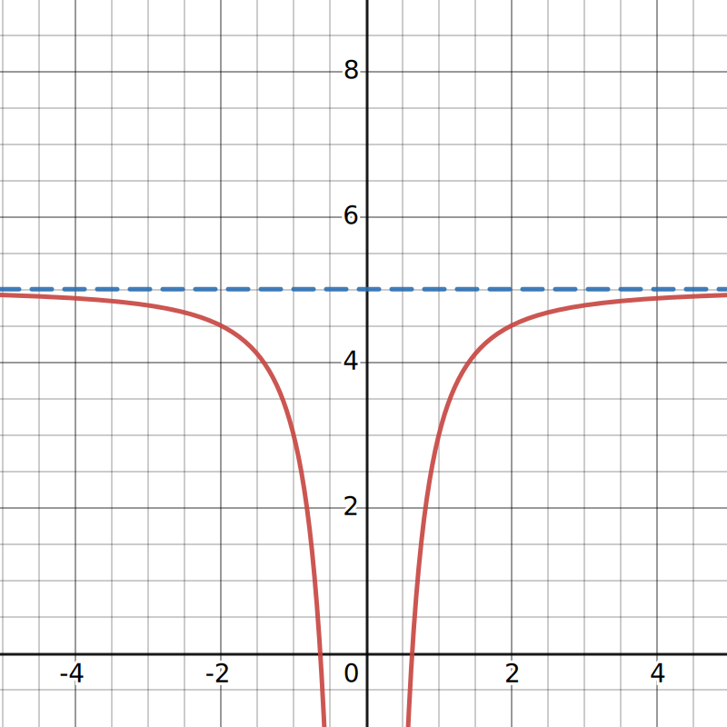
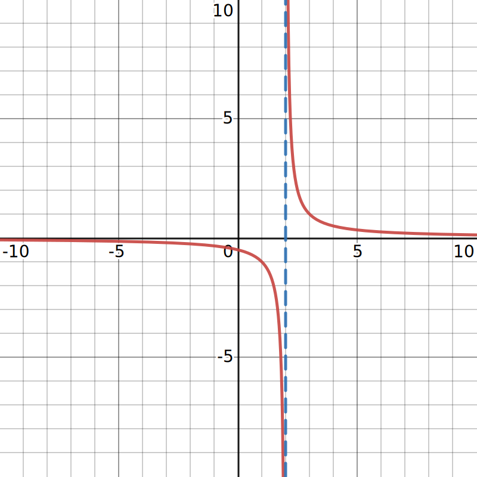

$$
    % Differentials d[something]/d[something]
    \gdef\diff#1#2{\frac{\mathrm{d}#1}{\mathrm{d}#2}}
    % Shortcut for dy/dx
    \gdef\dydx{\diff{y}{x}}
    % Shortcut for not implies
    \gdef\nimplies{\;\;\;\not\nobreak\!\!\!\!\implies\;}
    % Shortcuts for extended brackets
    \gdef\({\left(} \gdef\){\right)}
    % Shortcut for real number symbol
    \gdef\R{\mathbb{R}}
$$

# 4.6 — Limits at Infinity

# Recap

What does $\displaystyle\lim_{x\to a} f(x)$ mean?

If $\displaystyle\lim_{x\to a} f(x) = L$, it means that $f(x)$ gets **really close** to $L$ as $x$ gets **really close** to $a$.

For example, if $\displaystyle\lim_{x\to a} f(x) = 7$, it means that $f(x)$ gets **really close** to $7$ as $x$ gets **really close** to $5$.

# Limits at infinity

From here, we can extend this idea to limits at infinity. Namely, we can examine $\displaystyle\lim_{x\to \infty} f(x)$.

Meaning, we can find out what the function $f(x)$ approaches as $x$ gets larger and larger.

For example, to compute $\displaystyle\lim_{x\to \infty} x^2$, we can use a table and evaluate $x^2$ in increasing values of $x$ to find out its limit.

|    $x$    |      $x^2$      |
| :-------: | :-------------: |
|    $1$    |       $1$       |
|   $10$    |      $100$      |
|   $100$   |     $10000$     |
|  $1000$   |    $1000000$    |
|  $\dots$  |     $\dots$     |
| $1000000$ | $1000000000000$ |

Here, we can see that $x^2$ gets arbitrarily larger as the value of $x$ increases.

As such, we say that the limit of $x^2$ as $x$ tends to infinity is infinity. In notational fuckery, it is:
$$
\lim_{x\to\infty}x^2 = \infty.
$$

<def>

If the values of $f(x)$ become arbitrarily close to $L$ as $x$ becomes sufficiently large, we say that the function $f$ has a limit at infinity and write
$$
\lim_{x\to\infty}f(x) = L.
$$

</def>

## Evaluating limits using tables

<eg>

Evaluate $\displaystyle\lim_{x\to\infty} -7x$.

Again, we can set up a table to see what the limit of $-7x$ may be.

|    $x$    |   $-7x$    |
| :-------: | :--------: |
|    $1$    |    $-7$    |
|   $10$    |   $-70$    |
|   $100$   |   $-700$   |
|  $1000$   |  $-7000$   |
|  $\dots$  |  $\dots$   |
| $1000000$ | $-7000000$ |

Clearly, as $x\to\infty$, $-7x\to -\infty$. Thus,
$$
\lim_{x\to\infty}-7x = -\infty.
$$

</eg>

<eg>

Evaluate $\displaystyle\lim_{x\to\infty}\frac{1}{x}$.

|    $x$    | $\frac{1}{x}$ |
| :-------: | :-----------: |
|    $1$    |      $1$      |
|   $10$    |     $0.1$     |
|   $100$   |    $0.01$     |
|  $1000$   |    $0.001$    |
|   $...$   |     $...$     |
| $1000000$ |  $0.000001$   |

Here, we can see that as we increase the value of $x$ towards infinity, $\frac{1}{x}$ approaches $0$.

As such,
$$
\lim_{x\to\infty}\frac{1}{x} = 0.
$$

</eg>

The identity
$$
\lim_{x\to\infty}\frac{1}{x} = 0
$$

is going to be very important later on as it will help us evaluate the limits of more complicated functions, like the ones below.

## Evaluating limits using limit laws

<eg>

Compute $\displaystyle\lim_{x\to\infty}\(5 - \frac{2}{x^2}\)$.

Here, let's try to evaluate the limit without using the table because it is going to be a pain in the ass to evaluate them.

Instead, we can use the algebraic limit laws and the identity we mentioned earlier to help us evaluate the limit.

$$
\begin{aligned}
    \lim_{x\to\infty}\(5 - \frac{2}{x^2}\) &= \lim_{x\to\infty}(5) - \lim_{x\to\infty}\(\frac{2}{x^2}\) \\
    &= \lim_{x\to\infty}(5) - 2 \(\lim_{x\to\infty}\(\frac{1}{x^2}\)\) \\
    &= \lim_{x\to\infty}(5) - 2 \(\lim_{x\to\infty}\(\frac{1}{x}\)\lim_{x\to\infty}\(\frac{1}{x}\)\) \\
    &= 5 - 2(0 \cdot 0) \\
    &= 5
\end{aligned}
$$

Thus, $\displaystyle\lim_{x\to\infty}\(5 - \frac{2}{x^2}\) = 5$.

|                                                                                                 |                                                                                  |
| ----------------------------------------------------------------------------------------------- | -------------------------------------------------------------------------------- |
| If we graph $y= 5 - \frac{2}{x^2}$, we can see that there is a horizontal asymptote at $y = 5$. |  |

</eg>

<def>

## Limit and horizontal asymptote

In general, if
$$
\lim_{x\to\infty} f(x) = L
$$

or
$$
\lim_{x\to-\infty} f(x) = L.
$$

Then, we say that the line $y = L$ is a **horizontal asymptote** of $f$.

</def>

## Evaluating limits of rational functions

Okay, what about something like $\displaystyle\lim_{x\to\infty}\frac{-7x}{14+2x}$? How the fuck do we evaluate that?

<note>

As $x\to\infty$, it may appear as though $f(x)=\frac{-\infty}{\infty}$. However, $\frac{\infty}{\infty}$ is indeterminate. As such, we need to come up with another plan!

</note>

In cases like this, where we want the limit of a rational function, we can divide every term by $x^n$, where $n$ is the **highest power** of $x$ in the denominator. Then, evaluate the limit.

So, in order to evaluate $\displaystyle\lim_{x\to\infty}\frac{-7x}{14+2x}$, we first divide by the largest power of $x$ in the denominator. In this case, it's $x^1$.
$$
\begin{aligned}
    \lim_{x\to\infty}\frac{-7x}{14+2x} &= \lim_{x\to\infty}\frac{\frac{-7x}{x}}{\frac{14+2x}{x}} \\[1em]
    &= \lim_{x\to\infty}\frac{-7}{\frac{14}{x}+2} \\[1em]
\end{aligned}
$$

Then, we can use the limit laws and the known limit values to evaluate the limit.

$$
\begin{aligned}
    \lim_{x\to\infty}\frac{-7x}{\frac{14}{x}+2} &= \frac{\displaystyle\lim_{x\to\infty}-7}{\displaystyle\lim_{x\to\infty}{\frac{14}{x}+\displaystyle\lim_{x\to\infty}2}} \\[2.5em]
    &=\frac{-7}{0 + 2} \\[1em]
    &=-\frac{7}{2}
\end{aligned}
$$

We have that
$$
\lim_{x\to\infty}\frac{-7x}{14+2x}=-\frac{7}{2}.
$$

<eg>

Compute $\displaystyle\lim_{x\to\infty}\frac{6x^2-7x+3}{9x+2}$.

$$
\begin{aligned}
    \lim_{x\to\infty}\frac{6x^2-7x+3}{9x+2} &= \lim_{x\to\infty}\frac{\frac{6x^2-7x+3}{x}}{\frac{9x+2}{x}} \\
    &= \lim_{x\to\infty}\frac{6x-7+\frac{3}{x}}{9 + \frac{2}{x}} \\
    &= \frac{\displaystyle\lim_{x\to\infty}\(6x-7+\frac{3}{x}\)}{\displaystyle\lim_{x\to\infty}\(9 + \frac{2}{x}\)} \\[2em]
    &= \frac{\infty-7+0}{9+0} \\
    &= \infty
\end{aligned}
$$

<!--

<note>

The use of infinity here is to signify that the limit of the numerator is infinity. More specifically, $\displaystyle\lim_{x\to\infty}6x=\infty$. We put it in quotes because one can't actually add or deduct something to infinity.

</note>
 -->

</eg>

<eg>

Compute $\displaystyle\lim_{x\to\infty}\frac{7x-14}{x^3+10x-13}$.

$$
\begin{aligned}
    \lim_{x\to\infty}\frac{7x-14}{x^3+10x-13} &= \lim_{x\to\infty}\frac{\frac{7x-14}{x^3}}{\frac{x^3+10x-13}{x^3}} \\
    &= \lim_{x\to\infty}\frac{\frac{7}{x^2}-\frac{14}{x^3}}{1+\frac{10}{x^2}-\frac{13}{x^2}} \\[1em]
    &=\frac{\displaystyle\lim_{x\to\infty}\(\frac{7}{x^2}\)-\lim_{x\to\infty}\(\frac{14}{x^3}\)}{\displaystyle\lim_{x\to\infty}(1)+\lim_{x\to\infty}\(\frac{10}{x^2}\)-\lim_{x\to\infty}\(\frac{13}{x^2}\)} \\[2.5em]
    &= \frac{0}{1} \\[1em]
    &= 0
\end{aligned}
$$

</eg>

<eg>

Compute $\displaystyle\lim_{x\to2^+}\frac{1}{x - 2}$, $\displaystyle\lim_{x\to2^-}\frac{1}{x - 2}$, and $\displaystyle\lim_{x\to2}\frac{1}{x - 2}$.

To evaluate $\displaystyle\lim_{x\to2^+}\frac{1}{x - 2}$, we can set up a table for values of $x$ that approaches $2$ from the right.

|   $x$    | $\frac{1}{x-2}$ |
| :------: | :-------------: |
|  $2.1$   |      $10$       |
|  $2.01$  |      $100$      |
| $2.001$  |     $1000$      |
| $2.0001$ |     $10000$     |

Here, we can see that the values get closer to infinity as we approach $2$ from the right. As such,
$$
\lim_{x\to 2^+}\frac{1}{x-2} = \infty
$$

Then, we do a similar thing for $\displaystyle\lim_{x\to2^-}\frac{1}{x - 2}$.

|   $x$    | $\frac{1}{x-2}$ |
| :------: | :-------------: |
|  $1.9$   |      $-10$      |
|  $1.99$  |     $-100$      |
| $1.999$  |     $-1000$     |
| $1.9999$ |    $-10000$     |

Here, we see the opposite trend. The values are approaching negative infinity as we approach $2$ from the left. As such,
$$
\lim_{x\to 2^-}\frac{1}{x-2} = -\infty
$$

Since the limit as $x\to 2$ from either sides do not converge, we say that $\displaystyle\lim_{x\to2}\frac{1}{x - 2}$ does not exist.
$$
\lim_{x\to2^-}\frac{1}{x - 2}\neq\lim_{x\to2^+}\frac{1}{x - 2} \implies
\lim_{x\to2}\frac{1}{x - 2} \text{ does not exist}
$$

|                                                                                          |                                                                                  |
| ---------------------------------------------------------------------------------------- | -------------------------------------------------------------------------------- |
| If we graph $y=\frac{1}{x - 2}$, we can see that there is a vertical asymptote at $x=2$. |  |

</eg>

<def>

## Limit and vertical asymptote

In general, if
$$
\lim_{x\to a} f(x) = \infty
$$

or
$$
\lim_{x\to a} f(x) = -\infty.
$$

Then, we say that the line $x = a$ is a vertical asymptote of $f$.

</def>

<eg>

Compute $\displaystyle\lim_{x\to\infty}\frac{-10x+3}{7+2x}$.

Previously, when we had a rational function, we divided every term by $x^n$, where $n$ is the largest power in the denominator. Then, evaluated the limit.
$$
\begin{aligned}
    \lim_{x\to\infty}\frac{-10x+3}{7+2x} &= \lim_{x\to\infty}\frac{\frac{-10x}{x} + \frac{3}{x}}{\frac{7}{x}+\frac{2x}{x}} \\[1.5em]
    &= \lim_{x\to\infty} \frac{10+\frac{3}{x}}{\frac{7}{x}+2} \\[1.5em]
    &= \frac{-10+\displaystyle\lim_{x\to\infty}\frac{3}{x}}{\displaystyle\lim_{x\to\infty}\frac{7}{x}+2} \\[2.5em]
    &= \frac{-10+0}{0+2} \\[1em]
    &= -5
\end{aligned}
$$

</eg>

<eg>

## Evaluating limits of functions involving a radical

Compute $\displaystyle\lim_{x\to\infty}\frac{3x-2}{\sqrt{4x^2+5}}$.

Okay, now what? There's a fucking square root over the denominator. We can't just divide the denominator by $x^2$.

For large values of $x$, we have that
$$
\sqrt{4x^2+5}\approx\sqrt{4x^2}=2|x|.
$$

Which means that we can simply divide the numerator and denominator by $|x|$.
$$
\begin{aligned}
    \lim_{x\to\infty}\frac{3x-2}{\sqrt{4x^2+5}} &= \lim_{x\to\infty}\frac{\frac{1}{|x|}(3x-2)}{\frac{1}{|x|}\sqrt{4x^2+5}} \\
    &= \lim_{x\to\infty}\frac{\frac{3x-2}{x}}{\sqrt{\frac{4x^2+5}{x^2}}} \\
    &= \lim_{x\to\infty}\frac{3-\frac{2}{x}}{\sqrt{4+\frac{5}{x^2}}} \\
    &= \frac{3}{\sqrt{4}} \\
    &= \frac{3}{2}
\end{aligned}
$$

</eg>

<eg>

Compute $\displaystyle\lim_{x\to\infty}\frac{\sqrt{x^2+12x}}{15-8x}$.

Here's a switcheroo. The denominator is fine, so we can simply divide the numerator and denominator by $x$.
$$
\begin{aligned}
    \lim_{x\to\infty}\frac{\sqrt{x^2+12x}}{15-8x} &= \lim_{x\to\infty}\frac{\frac{1}{x}\sqrt{x^2+12x}}{\frac{15}{x}-\frac{8}{x}} \\
    &= \lim_{x\to\infty}\frac{\sqrt{\frac{x^2}{x^2}+\frac{12x}{x^2}}}{\frac{15}{x}-8} \\
    &= \lim_{x\to\infty}\frac{\sqrt{1+\frac{12}{x}}}{\frac{15}{x}-8} \\
    &= -\frac{1}{8}
\end{aligned}
$$

</eg>

<eg>

Evaluate $\displaystyle\lim_{x\to-4^+}\frac{3x}{(x+4)^5}$, $\displaystyle\lim_{x\to-4^-}\frac{3x}{(x+4)^5}$, and $\displaystyle\lim_{x\to-4}\frac{3x}{(x+4)^5}$.

<note>

Recall that $\displaystyle\lim_{x\to0^+}\frac{1}{x} = \infty$ and $\displaystyle\lim_{x\to0^-}\frac{1}{x} = -\infty$

</note>

As we approach $-4$ from the right ($-3.9, -3.99, -3.999, \dots$), we have that $3x$ will become negative. And $(x+4)^5$ will become positive. As such, we have that
$$
\lim_{x\to-4^+}\frac{3x}{(x+4)^5}=-\infty.
$$

As we approach $-4$ from the left ($-4.1, -4.01, -4.001, \dots$), we have that $3x$ will become negative. And $(x+4)^5$ will become positive. As such, we have that
$$
\lim_{x\to-4^-}\frac{3x}{(x+4)^5}=\infty.
$$

Finally,
$$
\lim_{x\to-4^-}\frac{3x}{(x+4)^5}\neq\lim_{x\to-4^+}\frac{3x}{(x+4)^5}\implies \lim_{x\to-4}\frac{3x}{(x+4)^5}\text{ does not exist}.
$$

</eg>

