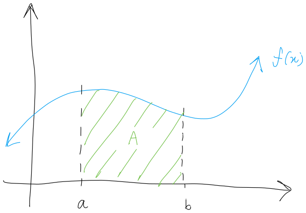
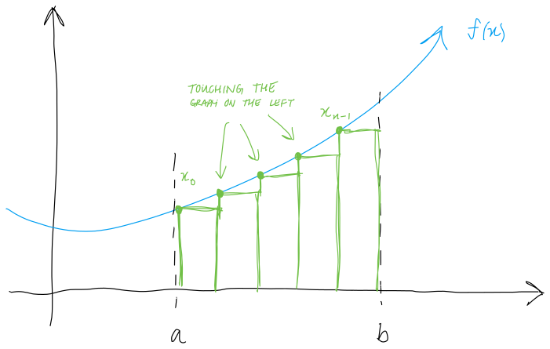

$$
    % Differentials d[something]/d[something]
    \gdef\diff#1#2{\frac{\mathrm{d}#1}{\mathrm{d}#2}}
    % Shortcut for dy/dx
    \gdef\dydx{\diff{y}{x}}
    % Differential letter "d" with a thin space before it
    \gdef\dd{\mathop{}\!\mathrm{d}}
    % Shortcut for not implies
    \gdef\nimplies{\;\;\;\not\nobreak\!\!\!\!\implies\;}
    % Shortcuts for extended brackets
    \gdef\({\left(} \gdef\){\right)}
    \gdef\[{\left[} \gdef\]{\right]}
    % Shortcut for real number symbol
    \gdef\R{\mathbb{R}}
$$

# 5.1 — Approximating Areas

# Sigma (summation) notation

Before discussing area, we need to discuss some notations.

The sigma notation is used to express sums in a clear, concise way.

For example, to write the sum
$$
1+2+3+4+5+6+7+8+9+10,
$$

one may write
$$
1+2+3+\dotsb+9+10
$$

where a pattern can be established to surmise what the dots are supposed to mean.

With the sum notation, we can write the same sum as
$$
\sum^{10}_{i=1}i,
$$

which is much more compact.

Typically, the sigma notation is in the form
$$
\sum^{n}_{i=1}a_i
$$

where:
* the sigma notation, $\sum$, means the "sum all the values of"
* $a_i$ is the term to be added
* $i=1$ is the term to begin with
* $n$ is the final term to be added.

<eg>

Expand $\displaystyle\sum^{5}_{i=1}3^i$.

$$
\sum^5_{i=1}3^i = 3^1+3^2+3^3+3^4+3^5
$$

</eg>

<eg>

Expand $\displaystyle\sum^6_{i=3}\frac{1}{i}$.

$$
\sum^6_{i=3}\frac{1}{i}=\frac{1}{3}+\frac{1}{4}+\frac{1}{5}+\frac{1}{6}
$$

</eg>

Now, the other way around.

<eg>

Write $1+2+3+\dotsb+112+113+114$ using the sum notation.

$$
1+2+3+\dotsb+112+113+114=\sum^{114}_{i=1}i
$$

</eg>

<eg>

Write $1+\frac{1}{2}+\frac{1}{3}+\dotsb+\frac{1}{9}+\frac{1}{10}$ using the sum notation.

$$
1+\frac{1}{2}+\frac{1}{3}+\dotsb+\frac{1}{9}+\frac{1}{10}=\sum^{10}_{i=1}\frac{1}{i}
$$

</eg>

<eg>

Write $1+4+9+16+25+\dotsb+81+100$ using the sum notation.

Notice that each sequence is a square number for $1$ to $10$.
$$
\begin{aligned}
    1&=1^2\\
    4&=2^2\\
    9&=3^2\\
    &\dotsb\\
    100&=10^2
\end{aligned}
$$

As such,
$$
1+4+9+16+25+\dotsb+81+100=\sum^{10}_{i=1}i^2.
$$

</eg>

<def>

## Properties of sigma notation

Let $c$ be a constant. The following properties hold for all $n\in\Z^+$ where $n$ is the number of terms.

1. $$
   \sum^n_{i=1}c = n\cdot c
   $$
2. $$
   \sum^n_{i=1}c\cdot a_i = c\cdot \sum^n_{i=1}a_i
   $$
3. $$
   \sum^n_{i=1}(a_i + b_i) = \sum^n_{i=1}a_i + \sum^n_{i=1}b_i
   $$
4. $$
   \sum^n_{i=1}(a_i - b_i) = \sum^n_{i=1}a_i - \sum^n_{i=1}b_i
   $$

</def>

<def>

## Nifty sum formulas

1. The sums of $n$ integers is given by
    $$
    \sum^n_{i=1}i = 1+2+3+\dotsb+n=\frac{n(n+1)}{2}.
    $$

2. The sum of consecutive integers squared is given by
   $$
   \sum^n_{i=1}i^2 = 1^2 + 2^2 + \dotsb + n^2 = \frac{n(n+1)(2n+1)}{6}.
   $$

3. The sum of consecutive integers cubed is given by
   $$
   \sum^n_{i=1}i^3 = 1^3 + 2^3 + \dotsb + n^3 = \frac{n^2(n+1)^2}{4}.
   $$

</def>

<eg>

Compute $\displaystyle\sum^{100}_{i=1}i$.

Using our [nifty formulas](#nifty-sum-formulas), we have that:
$$
\begin{aligned}
    \sum^{100}_{1=1}i &= \frac{100(100+1)}{2} \\
    &= 50\cdot101 \\
    &= 5050.
\end{aligned}
$$

</eg>

<eg>

Compute $\displaystyle\sum^{200}_{i=1}(i-3)^2$.

Using the [properties of the sum notation](#properties-of-sigma-notation), we can rewrite the sum.
$$
\begin{aligned}
    \sum^{200}_{i=1}(i-3)^2 &= \sum^{200}_{i=1}(i-3)(i-3) \\
    &= \sum^{200}_{i=1}(i^2-6i+9) \\
    &= \sum^{200}_{i=1}(i^2) - \sum^{200}_{i=1}(6i) + \sum^{200}_{i=1}(9) \\
    &= \sum^{200}_{i=1}(i^2) - 6\sum^{200}_{i=1}(i) + \sum^{200}_{i=1}(9)
\end{aligned}
$$

Then, we use our [nifty formula](#nifty-sum-formulas) to calculate the sum.
$$
\begin{aligned}
    \sum^{200}_{i=1}(i^2) - 6\sum^{200}_{i=1}(i) + \sum^{200}_{i=1}(9)
    &= \frac{200(201)(401)}{6}-6\(\frac{200\cdot201}{2}\)+9(200) \\
    &= 2686700 - 120600 +1800 \\
    &= 2567900
\end{aligned}
$$

</eg>

# Approximating areas

In geometry, students compute the area of shapes. But, there are a lot of practical applications to computing the area under curves.

For example, consider the function $f$ below. $A$ is the area under $f(x)$ from on $[a,b]$.

 

Now, how do we compute the area $A$?

It is difficult to compute the area, so we don't. Instead, we can divide the area into shapes that we can calculate the area of.

One way to do it is to divide the area into rectangles, and find the sum of those areas. The sum of all the areas of the rectangles will serve as an **approximation** for the area under $f(x)$ on $[a,b]$.

There are two main ways to divide up a region into rectangles: **left-endpoint** approximation and **right-endpoint** approximation.

|                                                                                                                                        |                                                                                                                                          |
| ---------------------------------------------------------------------------------------------------------------------------------------------------------------------------------------------------------------------- | ------------------------------------------------------------------------------------------------------------------------------------------------------------------------------------------------------------------------ |
| The **left-endpoint** approximation ensures that the **left-side** of the rectangles always intersect the function.  The left-endpoint approximation **undershoots** the area when the function is increasing. | The **right-endpoint** approximation ensures that the **right-side** of the rectangles always intersect the function.  The right-endpoint approximation **overshoots** the area when the function is increasing. |

## Performing an approximation

* First, we need to decide how many rectangles we want to use, and then break up our interval $[a,b]$ into that many subintervals of equal size. Then, we denote the amount of subintervals as $n$.

<note>

More rectangles means more accurate approximation.

</note>

* Then, we partition our region into equal-sized subintervals all of width $\Delta x$.
  $$
  \Delta x= \frac{b-a}{n}
  $$

  This divides our interval $[a,b]$ into subintervals in the form
  $$
  [x_0,x_1], [x_1,x_2], [x_2,x_3], \dots, [x_{n-1},x_n]. \\
  $$

* Finally, calculate the area of each rectangle and sum them up for our approximation. The areas of the rectangles differ depending on if we are using left- or right-endpoint approximation.

As noted, there are two ways to perform this approximation, which we will define below.

<def>

## Left-endpoint approximation

Where $n$ is the number of equally-sized subintervals of $[a,b]$, the width of each subinterval can be denoted as $\Delta x$ where
$$
\Delta x = \frac{b-a}{n}.
$$

To approximate the area, construct a rectangle with width $\Delta x$ and height $f(x_{i-1})$ for each subinterval $[x_{i-1}, x_i]$. Then, we have that the area of the rectangle for each subinterval (for $i=1,2,\dots,n$) is
$$
f(x_{i-1})\Delta x.
$$

As such, summing the areas of the rectangles will produce an approximate value for the area under the graph $A$.
$$
\begin{aligned}
    A\approx L_n
    &= \sum^n_{i=1} f(x_{i-1})\Delta x \\[1.5em]
    &= f(x_0)\Delta x + f(x_1)\Delta x + \dots + f(x_{n-1})\Delta x
\end{aligned}
$$

$L_n$ is used to denote that this is a **left-endpoint approximation** of $A$ using $n$ subintervals.

</def>

<def>

## Right-endpoint approximation

Where $n$ is the number of equally-sized subintervals of $[a,b]$, the width of each subinterval can be denoted as $\Delta x$ where
$$
\Delta x = \frac{b-a}{n}.
$$

To approximate the area, construct a rectangle with width $\Delta x$ and height $f(x_i)$ for each subinterval $[x_{i-1}, x_i]$. Then, we have that the area of the rectangle for each subinterval (for $i=1,2,\dots,n$) is
$$
f(x_{i-1})\Delta x.
$$

As such, summing the areas of the rectangles will produce an approximate value for the area under the graph $A$.
$$
\begin{aligned}
    A\approx R_n
    &= \sum^n_{i=1} f(x_i)\Delta x \\[1.5em]
    &= f(x_1)\Delta x + f(x_2)\Delta x + \dots + f(x_n)\Delta x
\end{aligned}
$$

$R_n$ is used to denote that this is a **right-endpoint approximation** of $A$ using $n$ subintervals.

</def>

<eg>

Perform left-endpoint approximation for the function $f(x)=\frac{x^2}{2}$ on $[0,3]$ using $6$ subintervals.

$$
\Delta x = \frac{b-a}{n} = \frac{3-0}{6}=\frac{1}{2}
$$

Then, we divide the interval into $6$ subintervals of size $\Delta x = 0.5$.
$$
[0,3] = [\bold0,0.5]\cup[\bold{0.5},1]\cup[\bold{1},1.5]\cup[\bold{1.5},2]\cup[\bold{2},2.5]\cup[\bold{2.5},3] \\
\implies
x_0 = 0,\quad
x_1 = 0.5,\quad
x_2 = 1,\quad
x_3 = 1.5,\quad
x_4 = 2,\quad
x_5 = 2.5
$$

Then, we have that our left-endpoint approximation is
$$
\begin{aligned}
    L_6=\sum^6_{i=1}f(x_{i-1})\Delta x &= f(x_0)\Delta x + f(x_1)\Delta x + f(x_2)\Delta x + \dotsb + f(x_5)\Delta x \\
    &= f(0)\Delta x + f(0.5)\Delta x + f(1)\Delta x + \dotsb + f(2.5)\Delta x \\
    &= 3.4375.
\end{aligned}
$$

</eg>

<eg>

Now, perform right-endpoint approximation for the same function $f(x)=\frac{x^2}{2}$ on $[0,3]$ using $6$ subintervals.

Again, the width of each subinterval is $0.5$.
$$
\Delta x = \frac{b-a}{n} = \frac{3-0}{6}=\frac{1}{2}
$$

Instead of using the left side of the rectangle for its height, we use the right, starting at $x_1$.
$$
[0,3] = [0,\bold{0.5}]\cup[0.5,\bold{1}]\cup[1,\bold{1.5}]\cup[1.5,\bold{2}]\cup[2,\bold{2.5}]\cup[2.5,\bold{3}] \\
\implies
x_1 = 0.5,\quad
x_2 = 1,\quad
x_3 = 1.5,\quad
x_4 = 2,\quad
x_5 = 2.5,\quad
x_6 = 3.
$$

Then, using the formula for the right-end approximation we have:
$$
\begin{aligned}
    R_6=\sum^6_{i=1}f(x_{i})\Delta x &= f(x_1)\Delta x + f(x_2)\Delta x + f(x_2)\Delta x + \dotsb + f(x_6)\Delta x \\
    &= f(0.5)\Delta x + f(1)\Delta x + f(1.5)\Delta x + \dotsb + f(3)\Delta x \\
    &= 5.6875
\end{aligned}
$$

</eg>

<eg>

Approximate the area under the curve of $y=x^2$ from $x=0$ to $x=3$ using right-endpoint approximation with $6$ subdivisions.

First, find the width of each subintervals.
$$
\Delta x = \frac{3-0}{6} = \frac{1}{2}
$$

Then, we divide the subintervals accordingly.
$$
[0,3] = [0,\bold{0.5}]\cup[0.5,\bold{1}]\cup[1,\bold{1.5}]\cup[1.5,\bold{2}]\cup[2,\bold{2.5}]\cup[2.5,\bold{3}]\\
\implies
x_1 = 0.5,\quad
x_2 = 1,\quad
x_3 = 1.5,\quad
x_4 = 2,\quad
x_5 = 2.5,\quad
x_6 = 3.
$$

Then, using the formula for the right-end approximation we have:
$$
\begin{aligned}
    R_6=\sum^n_{i=1} f(x_i)\Delta x &= \sum^6_{i=1}f(x_i)\cdot\frac{1}{2} \\
    &= \frac{1}{2}\cdot\sum^6_{i=1}f(x_i) \\
    &= \frac{1}{2}(0.5^2+1^2+1.5^2+2^2+2.5^2+3^2) \\
    &= 11.375
\end{aligned}
$$

</eg>

<eg>

Estimate the area under the graph of $f(x)=x^2+2x+1$ over the interval $[-1,2]$ with $8$ subdivisions using left-end subdivisions.

Again, find the width of each subinterval.
$$
\Delta x = \frac{2-(-1)}{8} = \frac{3}{8}
$$

Then, we divide the subintervals accordingly.
$$
\[-\frac{8}{8}, \frac{16}{8}\] = \[\bold{-\frac{8}{8}}, -\frac{5}{8}\]\cup\[\bold{-\frac{5}{8}}, -\frac{2}{8}\]\cup\[\bold{-\frac{2}{8}},\frac{1}{8}\]\cup\dots\cup\[\bold{\frac{13}{8}},\frac{16}{8}\]\\
\implies
x_0 = -1,\quad
x_1 = -\frac{5}{8},\quad
x_2 = -\frac{1}{4},\quad
\dots,\quad
x_6 = 3.
$$

Then, using the formula for the left-end approximation we have:
$$
\begin{aligned}
    L_8=\sum^n_{i=1}f(x_{i-1})\Delta x &= \sum^8_{i=1}f(x_{i-1})\cdot\frac{3}{8} \\
    &= \frac{3}{8}\cdot\sum^8_{i=1}f(x_{i-1}) \\
    &= \frac{3}{8}(f(x_0)+f(x_1)+f(x_2)+\dots+f(x_6))\\
    &= \text{use a fucking calculator}\\
    &= 7.3828
\end{aligned}
$$

</eg>

<!--

# Forming Riemann sum

We can actually use any point $x^*_i\in[x_{i-1},x_i]$ and use $f(x^*_i)$ to approximate the area under the graph. This gives us an estimate for the area $A$ of the form
$$
A \approx \sum^n_{i=1}f(x_i^*)\Delta x.
$$

This type of sum is called a Riemann sum, for which we will properly define using fancy language below.

<def>

## Riemann sum

Let $f(x)$ be defined on a closed interval $[a,b]$ and let $P$ be a regular partition of $[a,b]$.
Let $\Delta x$ be the width of each subinterval $[x_{i-1}, x_i]$. And for each $i$, let $x_i^*\in[x_{i-1}, x_i]$.
A **Riemann sum** is defined for $f(x)$ as
$$
\sum^n_{i=1}f(x_i^*)\Delta x.
$$

</def>

-->

Recall that we mentioned that the more partitions we create, the better the approximation gets.

And so in theory, if we are able to use infinite rectangles and perform infinite calculations for each partition. Then, our "approximation" would be exactly equal to the actual area.

<def>

## Area under the curve

In other words, the area under a function $f$ over an interval $[a,b]$ is
$$
\lim_{n\to\infty}\sum^n_{i=1}f(x_i^*)\Delta x
$$

where $f$ is a continuous, nonnegative function.

</def>

# Definite integral

The expression above can be expressed using what are called **definite integrals**.
$$
\lim_{n\to\infty}\sum^n_{i=1}f(x_i^*)\Delta x = \int_a^b f(x)\dd x
$$

<def>

If $f(x)$ is a function defined on an interval $[a,b]$, the **definite integral** of $f$ from $a$ to $b$ is given by
$$
\int_a^b f(x)\dd x = \lim_{n\to\infty}\sum_{i=1}^n f(x_i^*)\Delta x
$$

provided the limit exists.

If said limit exists, then $f(x)$ is said to be *integrable* on $[a,b]$, or is an *integrable function*.

</def>

## Area and the definite integral

$\displaystyle\int_a^b f(x)\dd x$ is a fancy way of saying "the area under the graph of $f$ from $a$ to $b$."

<eg>

Let $f(x)=-x+5$. Compute $\displaystyle\int_1^2 f(x)\dd x$.

|                                                                                    |                                                                                  |
| ---------------------------------------------------------------------------------- | -------------------------------------------------------------------------------- |
| Remember, this just means compute the area under the graph of $f$ from $1$ to $2$. |  |

The area can be divided into two. The right triangle at the top and the rectangle at the bottom.
$$
A_\text{triangle} = \frac{(2-1)(4-3)}{2} = \frac{1}{2} \\
A_\text{rectangle} = (2-1)(3-0) = 3 \\
\therefore A_\text{total} = 3.5
$$

And thus,
$$
\int_1^2 f(x)\dd x = 3.5.
$$

</eg>

<eg>

Compute $\displaystyle\int_2^6 (x-2)\dd x$.

|                                                                                    |                                                                                  |
| ---------------------------------------------------------------------------------- | -------------------------------------------------------------------------------- |
| Remember, this just means compute the area under the graph of $f$ from $2$ to $6$. |  |

Just a simple right triangle shape here.
$$
\int_1^2 (x-2)\dd x = \frac{(6-2)(4-0)}{2} = 8
$$

</eg>

<eg>

Compute $\displaystyle\int_0^2 (x-2)\dd x$.

<note>

If a function lies under the x-axis, then the integral will be negative during that interval.

</note>

|                                                                                                            |                                                                                  |
| ---------------------------------------------------------------------------------------------------------- | -------------------------------------------------------------------------------- |
| Since the entire area on $[0,2]$ is under the x-axis. We calculate the area as usual and make it negative. |  |

$$
\int_0^2 (x-2)\dd x = -\frac{2\cdot2}{2} = -2
$$

</eg>

<eg>

Compute $\displaystyle\int_0^6 (x-2)\dd x$.

|                                                                          |                                                                                  |
| ------------------------------------------------------------------------ | -------------------------------------------------------------------------------- |
| Notice that this is the sum of the areas from the previous two examples. |  |

Intuitively, we simply subtract the area under the x-axis (red) from the area above (green).
$$
\begin{aligned}
    \int_0^6 (x-2)\dd x &= \textcolor{#C64441}{\int_0^2 (x-2)\dd x} + \textcolor{#3A8D4A}{\int_2^6 (x-2)\dd x} \\
    &= \textcolor{#C64441}{-2}+\textcolor{#3A8D4A}{8} \\
    &= 4
\end{aligned}
$$

</eg>

The last example brings us to the properties of definite integrals.

<def>

## Properties of the definite integral

1. If the limits of integration are the same, the integral is just a line and contains no area.
   $$
   \int_a^a f(x)\dd x = 0
   $$

2. If the limits are reversed, then place a negative sign in front of the integral.
   $$
   \int_a^b f(x)\dd x = -\int_b^a f(x)\dd x
   $$

3. The integral of a sum is the sum of the integrals.
   $$
   \int_a^b [f(x)+g(x)] \dd x = \int_a^b f(x) \dd x + \int_a^b g(x)\dd x
   $$

4. The integral of a difference is the difference of the integrals.
   $$
   \int_a^b [f(x)-g(x)] \dd x = \int_a^b f(x) \dd x - \int_a^b g(x)\dd x
   $$

5. Where $c$ is a constant, the integral of the product of a constant and a function is equal to the constant multiplied by the integral of the function.
   $$
   \int_a^b cf(x)\dd x = c\int_a^b f(x)
   $$

</def>

