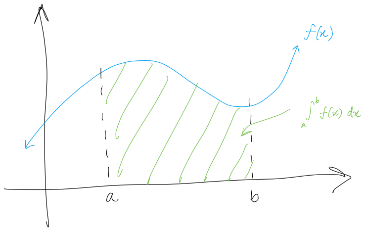

$$
    % Differentials d[something]/d[something]
    \gdef\diff#1#2{\frac{\mathrm{d}#1}{\mathrm{d}#2}}
    % Shortcut for dy/dx
    \gdef\dydx{\diff{y}{x}}
    % Differential letter "d" with a thin space before it
    \gdef\dd{\mathop{}\!\mathrm{d}}
    % Shortcut for not implies
    \gdef\nimplies{\;\;\;\not\nobreak\!\!\!\!\implies\;}
    % Shortcuts for extended brackets
    \gdef\({\left(} \gdef\){\right)}
    \gdef\[{\left[} \gdef\]{\right]}
    % Shortcut for real number symbol
    \gdef\R{\mathbb{R}}
$$

# 5.3 — The Fundamental Theorem of Calculus

We will now talk about the most important theorem in all of calculus, aptly named **The Fundamental Theorem of Calculus**, which we will break into two parts. The first part links derivatives and integrals.

Recall that $\displaystyle\int_a^b f(x)\dd x$ means the area under $f(x)$ from $x=a$ to $x=b$.

 

We have two main ways of calculating this area.
1. Using the geometry if the shape was "nice," like triangles and rectangles.
   As you can see, the example above is nasty so we can't use geometry to calculate the area of something like that.
2. Or, approximating the area using rectangles.

The *Fundamental Theorem* provides us a third avenue to solve integrals (in other words, areas) that relies on a connection between derivatives and integrals.

# Part 1: Integrals and antiderivatives

This part establishes the relationship between integration and differentiation. Essentially, it guarantees that any integrable function has an antiderivative.

In other words, the derivative of the integral of a function $f$ *is* the function $f$ itself.

<theo>

## The Fundamental Theorem of Calculus, Part 1

If $f(x)$ is continuous over an interval $[a,b]$ and the function $F(x)$ is defined by
$$
F(x) = \int_a^x f(t)\dd t.
$$

Then, $F'(x) = f(x)$ over $[a,b]$.

</theo>

<eg>

Let $\displaystyle g(x) = \int_1^x\frac{1}{t^3+1} \dd t$. Find $g'(x)$.

Using the fundamental theorem, let $f(t)=\frac{1}{t^3+1}$. Then,
$$
g'(x) = f(x) = \frac{1}{x^3+1}.
$$

</eg>

<eg>

Let $\displaystyle f(x) = \int_{-2}^x\cos(t^5)\dd t$. Find $f'(x)$.

Again, the derivative of the integral is just the integrand itself. And so,
$$
f'(x) = \cos(t^5).
$$

</eg>

## Fundamental Theorem and properties of the definite integral

Note that the [Fundamental Theorem](#the-fundamental-theorem-of-calculus-part-1) requires the constant to be at the bottom and the variable to be at the top. When that isn't the case, we can use the properties of the definite integral to rewrite our integral in a way that fits the theorem.

With that in mind, recall that:
$$
\int_a^b f(x)\dd x = -\int_a^b f(x)\dd x
$$

and use it to calculate the derivatives.

<eg>

Let $\displaystyle h(x)=\int_x^{13} t^5\dd t$. Find $h'(x)$.

Notice that this doesn't quite satisfy our theorem, which requires a constant to be at the bottom -- i.e., go from a constant to $x$.

Using the integral rule
$$
\int_a^b f(x)\dd x = -\int_a^b f(x)\dd x,
$$

we can rewrite our integral in order to use the theorem.

$$
h(x)=\int_x^{13} t^5\dd t =-\int_{13}^x t^5\dd t
$$

And so we have that
$$
h'(x) = -t^5.
$$

</eg>

<eg>

Let $\displaystyle f(x) = \int_x^1\sin t^5 \dd t$. Find $f'(x)$.

Again, we can rewrite the integral to use our theorem.
$$
f(x) = \int_x^1\sin t^5 \dd t = - \int_1^x\sin t^5 \dd t
$$

Therefore,
$$
f'(x) = -\sin t^5.
$$

</eg>

## Fundamental Theorem and the chain rule

The fundamental theorem also works if we integrate from $a$ to **a function of $\bm{x}$** . But, we need to apply the chain rule.

<def>

If $F(x)$ is a function defined by
$$
F(x) = \int_a^{u(x)}f(t)\dd t
$$

where $u(x)$ is a function. Then $F'(x) = f(u(x))\cdot u'(x)$

</def>

<eg>

Let $\displaystyle F(x) = \int_1^{x^2}t^4 \dd t$. Find $f'(x)$.

Using the definition, let $u(x) = x^2$. Then,
$$
\begin{aligned}
    f'(x) &= f(u(x))\cdot u'(x) \\
    &= u(x)^4\cdot u'(x) \\
    &= (x^2)^4 \cdot 2x \\
    &= 2x^9.
\end{aligned}
$$

</eg>

<eg>

Let $h(x) = \displaystyle\int_1^{\sqrt{x}} \sin t \dd t$. Find $h'(x)$.

Again, let $u(x)=\sqrt{x}$. Then,
$$
\begin{aligned}
    h'(x) &= \sin(u(x))u'(x) \\
    &= \sin{\sqrt{x}} \cdot \frac{1}{2\sqrt{x}} \\
    &= \frac{\sin\sqrt{x}}{2\sqrt{x}}
\end{aligned}
$$

</eg>

## Fundamental Theorem with two variable limits of integration

With variables on both ends of the integral, we need some other way to introduce a constant on one of the ends. We can't simply flip it and use the Theorem to calculate the derivative.

Recall that:
$$
\int_a^b f(x)\dd x = \int_a^c f(x) \dd x + \int_c^b f(x)\dd x.
$$

This says that the area under $f(x)$ from $x=a$ to $x=b$ is equal to the sum of area under $f(x)$ from $x=a$ to $x=c$ and the area under $f(x)$ from $x=c$ to $x=b$ for some number $c$ such that $a\leq c \leq b$.

 

<eg>

Let $\displaystyle f(x) = \int_x^{2x}t^3\dd t$. Find $f'(x)$.

Here, we have variables at both ends. We can't just flip it and apply the theorem.

We can however, introduce a constant using the sum rule of integral that we mentioned.

$$
\begin{aligned}
    f(x) = \int_x^{2x}t^3\dd t &= \int_x^{0}t^3\dd t + \int_0^{2x}t^3\dd t \\
    &= -\int_0^{x}t^3\dd t + \int_0^{2x}t^3\dd t \\
    \therefore f'(x) &= -x^3 + (2x)^3 + \diff{}{x}(2x) \\
    &= -x^3 + 8x^3 \cdot 2 \\
    &= -x^3 + 16x^3 \\
    &= 15x^3
\end{aligned}
$$

Then, we flip the limits of the first term so that we can apply the theorem (constant at the bottom).
$$
\int_x^{0}t^3\dd t + \int_0^{2x}t^3\dd t =  -\int_0^{x}t^3\dd t + \int_0^{2x}t^3\dd t
$$

Differentiating the first term, we have that
$$
\diff{}{x}\[-\int_0^xt^3\dd t\] = -x^3.
$$

And then the second term. Note that $2x$ is a function of $x$, so the chain rule applies here.
$$
\begin{aligned}
    \diff{}{x}\[\int_0^{2x}t^3 \dd t\] &= (2x)^3\diff{}{x}(2x) \\
    &= (2x)^3 \cdot 2 \\
    &= 16x^3
\end{aligned}
$$

Finally, to get $f'(x)$, we add the results of the two terms.
*Remember, we split $f(x)$ into two parts at the start.*
$$
\begin{aligned}
    f(x) &= \int_x^{2x}t^3\dd t \\[1em]
    &= \int_x^{0}t^3\dd t + \int_0^{2x}t^3\dd t \\[1em]
    \therefore f'(x) &= \diff{}{x}\[\int_x^{0}t^3\dd t\] + \diff{}{x}\[\int_0^{2x}t^3\dd t\] \\[1em]
    &= -x^3 + 16x^3 \\
    &= 15x^3
\end{aligned}
$$

</eg>

# Part 2: The evaluation theorem

Recall that we still had no way to calculate the exact area under a nasty curve. What we have used previously only gave us an approximation of those areas.

Part 2 of this theorem will give us a way to get the exact value of the area under a graph without having to approximate it using the rectangles.

<theo>

## The Fundamental Theorem of Calculus, Part 2

If $f$ is continuous over the interval $[a,b]$ and $F(x)$ is any antiderivative of $f(x)$, then
$$
\int_a^b f(x) \dd x = F(b) - F(a).
$$

</theo>

Essentially, it states that if we can find an antiderivative for the integrand, then we can evaluate the definite integral by evaluating the antiderivative at the endpoints of the interval and subtracting them.

<eg>

Evaluate $\displaystyle\int_0^3 x^2 \dd x$.

|                                                                                                                                                                          |                                                                                  |
| ------------------------------------------------------------------------------------------------------------------------------------------------------------------------ | -------------------------------------------------------------------------------- |
| The area from $x=0$ to $x=3$ almost looks like it's a triangle.  Unfortunately, since $y=x^2$ is a parabola, we can't just use geometry to get its **exact area**. |  |

In order to use the Fundamental Theorem, we first need the antiderivative.

So, let $f$ be our function and $F$ be the antiderivative of that function.

Using our reverse power rule, we have that:
$$
f(x) = x^2 \implies F(x) = \frac{x^3}{3}+c.
$$

Then, it's just the matter of using [the Theorem](#the-fundamental-theorem-of-calculus-part-2).
$$
\begin{aligned}
    \int_0^3 x^2\dd x &= F(b) - F(a) \\
    &= F(3) - F(0) \\
    &= \(\frac{3^3}{3}+c\) - \(\frac{0^3}{3}+c\) \\
    &= 9 + c - c \\
    &= 9
\end{aligned}
$$

And that's it. The area under the curve $y=x^2$ is from $x=0$ to $x=3$ is $9$ units squared. Thus,
$$
\int_0^3 x^2\dd x = 9.
$$

No approximation, no complicated sums, no geometry bullshit. Just plug-and-chug.

</eg>

<eg>

Evaluate $\displaystyle\int_{-2}^2(x^2-4)\dd x$.

|                                                                                                                                                                   |                                                                                  |
| ----------------------------------------------------------------------------------------------------------------------------------------------------------------- | -------------------------------------------------------------------------------- |
| From the graph, we see that the area from $x=-2$ to $x=2$ lies completely below the x-axis.  This means that the answer we get should come out as negative. |  |

Again, we first find the antiderivative of the integrand.
$$
f(x) = x^2 - 4 \implies F(x) = \frac{x^3}{3}-4x+c
$$

Then, apply [the Theorem](#the-fundamental-theorem-of-calculus-part-2).
$$
\begin{aligned}
    \int_{-2}^2 (x^2-4)\dd x &= F(2) - F(-2) \\
    &= \(\frac{2^3}{3}-4(2)+c\) - \(\frac{-2^3}{3}-4(-2)+c\) \\
    &= \(\frac{8}{3}-8+c\) - \(\frac{-8}{3}+8+c\) \\
    &= \frac{8}{3} - 8 + \cancel{c} + \frac{8}{3} - 8 - \cancel{c} \\
    &= \frac{16}{3} - 16 \\
    &= -\frac{32}{3}
\end{aligned}
$$

</eg>

## About the $+c$ in the antiderivatives
When computing $F(b)-F(a)$, the $+c$ in the antiderivative will **always** cancel out as we saw in the examples above. So, for the purpose of performing integration, there is no need to include it.

## Notational fuckery
Where $F$ is the antiderivative of the function $f$, the notation $F(x)\vert_a^b$ can be used to denote the expression $F(b)-F(a)$.
  $$
  \int_a^b f(x) \dd x = F(b) - F(a) = F(x)\vert_a^b
  $$

<eg>

Evaluate $\displaystyle\int_2^7(6x^2-10x+8)\dd x$.

With those notes in mind, we drop the $+c$ in our steps and use the new notation.
$$
\begin{aligned}
    \int_2^7(6x^2-10x+8)\dd x &= \left.\(\frac{6x^3}{3} - \frac{10x^2}{2} + 8x \)\right|_2^7 \\
    &= \left.\(2x^3 - 5x^2 + 8x \)\right|_2^7 \\
    &= (2(7)^3 - 5(7)^2 + 8(7)) - (2(2)^3 - 5(2)^2 + 8(2)) \\
    &= (686-245+56) - (16-20+16) \\
    &= 686-245+56-16+20-16 \\
    &= 485
\end{aligned}
$$

</eg>

<eg>

Evaluate $\displaystyle\int_0^\pi 10\sin x\dd x$.

<note>

$$
\diff{}{x}\cos x = -\sin x \\
\therefore \diff{}{x}-\cos x = \sin x
$$

</note>

$$
\begin{aligned}
    \int_0^\pi 10\sin x \dd x &= \left.(-10\cos x) \right|_0^\pi \\
    &= (-10\cos\pi) - (-10\cos0) \\
    &= (-10\cdot -1) - (-10\cdot 1) \\
    &= 10 - (-10) \\
    &- 20
\end{aligned}
$$

</eg>

<eg>

Evaluate $\displaystyle\int_{-2}^1(x+2)(x-3)\dd x$.

<important>

$$
\int_{-2}^1(x+2)(x-3)\dd x \nimplies \(\frac{x^2}{2}+2x\)\(\frac{x^2}{2}-3x\) +c
$$

The product rule applies here, so we cannot integrate them separately. However, the reverse product rule is too complicated for us. Instead, we apply some algebra to rewrite the integrand and solve it using the methods we know.

</important>

First, FOIL the bitch out.

$$
\begin{aligned}
    \int_{-2}^1(x+2)(x-3)\dd x &= \int_{-2}^1(x^2-3x+2x-6)\dd x \\
    &= \int_{-2}^1(x^2-x-6)\dd x \\
\end{aligned}
$$

Then, apply the reverse power rule and [the Theorem](#the-fundamental-theorem-of-calculus-part-2).
$$
\begin{aligned}
    \int_{-2}^1(x^2-x-6)\dd x &= \left.\(\frac{x^3}{3} - \frac{x^2}{2} - 6x\)\right|_{-2}^1 \\
    &= \(\frac{1^3}{3} - \frac{1^2}{2} - 6(1)\) - \(\frac{(-2)^3}{3} - \frac{(-2)^2}{2} - 6(-2)\)\\
    &= -\frac{37}{6}-\frac{22}{3} \\
    &= -\frac{27}{2}
\end{aligned}
$$

</eg>

<eg>

Evaluate $\displaystyle\int_1^9\frac{x-1}{\sqrt{x}}\dd x$.

<important>

Just like the previous example, the reverse quotient rule would apply here. Since we can't do that, we rewrite the integrand in a way that we can solve.

</important>

Rewrite the problem so we can use the reverse power rule instead of some complicated stuff.

$$
\begin{aligned}
    \int_1^9\frac{x-1}{\sqrt{x}}\dd x &= \int_1^9\frac{x-1}{x^{\frac{1}{2}}}\dd x \\
    &= \(\int_1^9\frac{x}{x^\frac{1}{2}} - \frac{1}{x^\frac{1}{2}}\) \dd x \\
    &= \(\int_1^9 x^{1-\frac{1}{2}} - x^{-\frac{1}{2}}\)\dd x \\
    &= \int_1^9 \(x^\frac{1}{2} - x^{-\frac{1}{2}}\) \dd x \\
\end{aligned}
$$

Finally, we evaluate the integral using the reverse power rule and [the Theorem](#the-fundamental-theorem-of-calculus-part-2).
$$
\begin{aligned}
    \int_1^9 \(x^\frac{1}{2} - x^{-\frac{1}{2}}\) \dd x &= \left.\(\frac{x^\frac{3}{2}}{\frac{3}{2}}-\frac{x^\frac{1}{2}}{\frac{1}{2}}\)\right|_1^9 \\[1.5em]
    &=
    \left.\(\frac{2}{3}x^{\frac{3}{2}} - 2x^\frac{1}{2}\)\right|_1^9 \\[1em]
    &= \(\frac{2}{3}(9)^{\frac{3}{2}} - 2(9)^\frac{1}{2}\) - \(\frac{2}{3}(1)^{\frac{3}{2}} - 2(1)^\frac{1}{2}\) \\[1em]
    &= \(\frac{2}{3}(27)-2(3)\) - \(\frac{2}{3}(1)-2(1)\) \\
    &= 18-6-\frac{2}{3}+2 \\
    &= \frac{40}{3}
\end{aligned}
$$

</eg>

